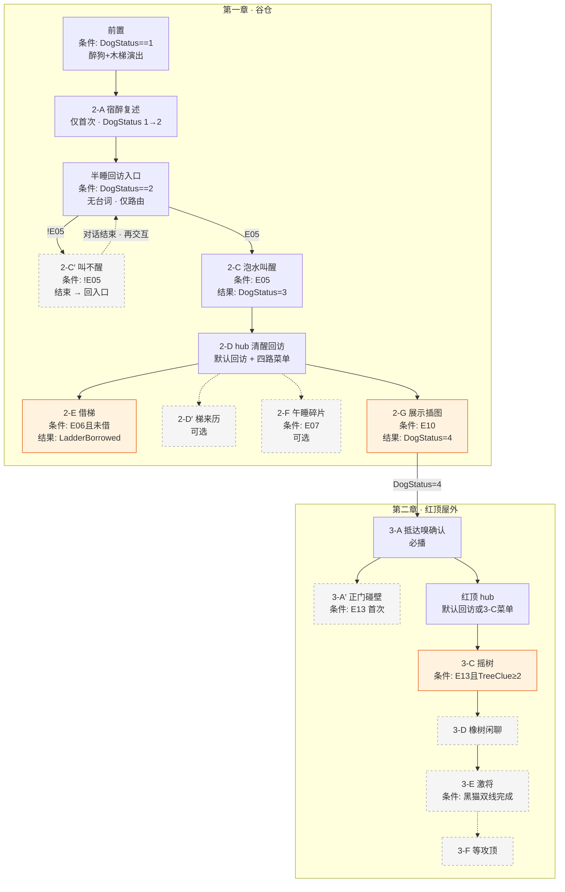

# 大黄 · 对话脚本（树状样章）

> **状态**：大黄对话**实施准稿**（以本树状脚本为准）。  
> **变量**：全局定义见 [17-全局游戏状态变量](../17-全局游戏状态变量.md)；本脚本只引用该表中的名，不另造变量。

---

## 本脚本引用的变量


| 变量                                          | 本脚本读 / 写                                   |
| ------------------------------------------- | ------------------------------------------ |
| `DogStatus`                                 | 写：`2-A`→2 · `2-C`→3 · `2-G`→4              |
| `E05_GrainSoakGet`                          | 读（**E05** 写入）                              |
| `E06_ViewNeedLadder` / `E06_LadderBorrowed` | 读；`2-E` 写 `E06_LadderBorrowed`             |
| `E07_ViewNapSpot` / `E10_NoteIllust`        | 读（环境写入）                                    |
| `E13_ViewDoorBlocked` / `TreeClueCount`     | 读（**E13** / **E14–16·E28** 写入）             |
| `RedRoof_`* / `Dog_BlackCatSummoned`        | 读 + 部分写（`RedRoof_`* = 一次性台词 flag；见各节点【变量】） |
| `BlackCat_`*                                | 读（黑猫脚本写入）                                  |
| `NGPlus`                                    | 读                                          |


**分支写法**：`「对话单句」`（条件）→ 节点；`(条件) → 节点` 用于无选项句跳转。

---

## 格式说明

**原则**：台词只有一种写法（`角色：…` / `描述：（…）`）。标签**只标结构行为**，不重复标「这是不是正文」。

### 台词行

`角色：台词`（无引号）· `描述：（动作或表情）` · 质询 = 玩家自然台词 + `E##_` 锁（不写 UI 标签）

### 结构标签


| 标签           | 何时用                  | 行为                               |
| ------------ | -------------------- | -------------------------------- |
| **【正文】**     | 普通节点、子节点、自动触发的必播段    | 本场完整对话；逐句点击；**多 NPC 同场写在一起**     |
| **【条件插入】**   | 某段【正文】之后，仅当条件成立才多播   | 插在上一段【正文】与 `→` 出口之间              |
| **【条件收束】**   | 节点末尾按条件出不同玩家 OS，然后结束 | 多条 `「OS」`（条件）互斥；播完 `→` 出口        |
| **【hub·回访】** | hub 节点内              | 每次点 NPC **固定先播**（非轮播）            |
| **【hub·菜单】** | hub 节点内，接在回访之后       | **短选项** + 条件 → 子节点；子节点内用【正文】首句展开 |
| **【轮播池】**    | 无可控菜单的回访             | 多条**完整对白**等权重择一；空行分隔各池           |
| **【路由】**     | 无台词                  | 仅 `(条件) → 节点`                    |
| **【变量】**     | 有写入的节点               | 本节点**全文播毕**后写入，再 `→` 出口          |


**【正文】**：本场**完整对话**，所有在场说话方（大黄 / 玩家 / 黑猫 …）写在同一节点里；按 `角色：` 区分，不按 NPC 拆文件。

**出口 `→`**：本树内跳转（`→ 2-D hub` · `→ 第二章` · `→ 结束`）。不写 `→ 某 NPC 脚本`。

### 节点类型（组合方式）


| 类型        | 典型组合                                   |
| --------- | -------------------------------------- |
| **必播节点**  | 【正文】±【条件插入】→【变量】?                      |
| **hub**   | 【hub·回访】? + 【hub·菜单】? → 子节点【正文】→ 回 hub |
| **菜单子节点** | 【正文】（首句展开菜单短句）→【变量】? → 回 hub           |
| **路由入口**  | 【路由】                                   |
| **轮播回访**  | 【轮播池】                                  |


---

## 流程总览

> 读法：先扫 **段落速览表** 把握条件与结果；**分章流程图** 看主链与可选分支。节点编号（2-A 等）仅用于正文跳转。

### 段落速览

#### 第一章 · 谷仓（`DogStatus` 1 → 4）


| 节点               | 进入条件                                           | 段落概括                                | 结果 / 变量                           |
| ---------------- | ---------------------------------------------- | ----------------------------------- | --------------------------------- |
| **前置**           | `DogStatus == 1`                               | 谷仓墙根：醉倒大黄、侧倒木梯、鼾声演出                 | → 直入 2-A                          |
| **2-A 半睡复述**     | `DogStatus == 1`（仅首次）                          | 宿醉交代「乌鸦叼蛋上屋顶」；若已调查 **E06** 插入「挪不开梯」 | `DogStatus = 2`；笔记三条 → **半睡回访入口** |
| **半睡回访入口**       | `DogStatus == 2`（再次交互）                         | **无台词**；按是否持泡水路由                    | 有 `E05` → **2-C**；无 → **2-C′**    |
| **2-C 泡水叫醒**     | `DogStatus == 2` 且 `E05_GrainSoakGet`          | 交谷物泡水，大黄站起清醒                        | `DogStatus = 3` → **2-D hub**     |
| **2-C′ 叫醒失败**    | `DogStatus == 2` 且 `!E05_GrainSoakGet`         | 拍不醒 + 玩家 OS 提示去找醒酒物                 | 对话结束 → 回 **半睡回访入口**               |
| **2-D hub 清醒回访** | `DogStatus == 3`                               | 【hub·回访】+【hub·菜单】四路                 | 菜单播完均回 hub                        |
| ↳ **2-E 借梯**     | 菜单：`E06_ViewNeedLadder && !E06_LadderBorrowed` | 交出短木梯                               | `E06_LadderBorrowed = true`       |
| ↳ **2-D′ 梯来历**   | 菜单：无额外锁                                        | 追乌鸦摔梯、没回狗窝                          | —                                 |
| ↳ **2-F 午睡点**    | 菜单：`E07_ViewNapSpot`                           | 模糊看到灰物跑向红顶屋                         | —                                 |
| ↳ **2-G 展示插图**   | 菜单：`E10_NoteIllust`                            | 白石头非真蛋；保安归位，嗅觉指红顶屋                  | `DogStatus = 4` → **第二章**         |


#### 第二章 · 红顶屋外（`DogStatus == 4`）


| 节点             | 进入条件                                             | 段落概括                          | 结果 / 变量                        |
| -------------- | ------------------------------------------------ | ----------------------------- | ------------------------------ |
| **3-A 抵达确认**   | `DogStatus == 4` 且 `!RedRoof_IntroShown`         | 嗅觉二次确认「蛋在这屋里」                 | `RedRoof_IntroShown = true`    |
| **3-A′ 正门碰壁**  | `E13_ViewDoorBlocked` 且 `!RedRoof_DoorHintShown` | 一次性：正门进不去，另找入口                | `RedRoof_DoorHintShown = true` |
| **红顶 hub**     | `DogStatus == 4` 且 `!Dog_BlackCatSummoned`       | 锁未开 →【hub·回访】；已开 →【hub·菜单】3-C | —                              |
| ↳ **3-C 摇树召唤** | 菜单：`E13 && TreeClueCount >= 2`                   | 想起黑猫与猫门，摇橡树                   | `Dog_BlackCatSummoned = true`  |
| **3-D 橡树下闲聊**  | `Dog_BlackCatSummoned` 且 `!BlackCat_Entered`     | 【轮播池】四轮                       | —                              |
| **3-E 激将黑猫**   | 双线完成且猫未进屋                                        | 大黄催动身；黑猫自述动机后起身进猫门            | `BlackCat_Entered = true`      |
| **3-F 等攻顶**    | `BlackCat_Entered` 且 `!RedRoof_RoofWaitShown`    | 一次性：天窗攻顶前加油                   | `RedRoof_RoofWaitShown = true` |


#### 二周目


| 节点       | 进入条件     | 段落概括    | 结果  |
| -------- | -------- | ------- | --- |
| **回访轮播** | `NGPlus` | 【轮播池】四轮 | —   |


### 分章流程图




**图例**：橙色 = 关键质询；灰虚框 = 可选 / 一次性旁支；实线 = 主链。

### 回访与入口（对照 Unity Dialogue System）

成熟编辑器里，**2-A 播完不会写「出口分支」在同一张对话表末尾**——而是：


| 概念       | 本样章                             | Unity Dialogue System（Pixel Crushers）等                      |
| -------- | ------------------------------- | ----------------------------------------------------------- |
| 一次性初见    | **2-A**                         | 独立 Conversation / Sequence，`Once` 或变量 `DogStatus==1` 才进     |
| 再次点击 NPC | **半睡回访入口**                      | Conversation **Start** 或 **Entry** 节点：无台词，仅 **Condition** 链 |
| 路由       | `(E05) → 2-C` / `(!E05) → 2-C′` | Link 上挂 `Condition: Variable["E05"]`；不满足则试下一条               |
| 2-C′ 播完  | 回 **半睡回访入口**                    | 对话 **Stop**；下次 `Use()` 重新从 Start 评估条件                       |
| 清醒后      | **2-D hub**                     | 另一 Entry 分支 `DogStatus==3`，或另一 Conversation                 |


**本项目的半睡阶段**：`DogStatus==2` 时玩家每次交互都先走 **半睡回访入口**（不重复 2-A 全文）；取得 `E05` 后同入口改路由到 **2-C · 泡水叫醒（成功）**。

---

## 一、阶段 · 前置 / 完全睡

> 〔系统注〕**E04** 不走线索大图；描述兼作初见演出。初见完成由 `DogStatus` 表达，不设 `E04_`* bool（见 `17`）。

```text
前置
│
└─ 【正文】（DogStatus == 1）
    描述：（谷仓墙根旁，一架短木梯侧倒在地，一只大黄色的狗半压在上面，低沉的鼾声带着哨音）
    → 2-A
```

---

## 二、主交互阶段

---

### 2-A · 半睡复述（仅首次）

> 〔系统注〕**E04** · `DogStatus == 1` 时自动进入，**只播一次**。播完 `DogStatus=2`，之后交互改走 **半睡回访入口**（不重复本段全文）。

```text
2-A（DogStatus == 1）
│
├─ 【正文】
│   大黄：嗝——
│   大黄：谁……
│   玩家：淑芬的蛋不见了。你看到过什么吗？
│   描述：（大黄的耳朵动了一下，目光慢慢聚过来）
│   大黄：蛋……乌鸦……叼走了。
│   玩家：乌鸦？
│   大黄：嗯……飞到谷仓屋顶去了。我追了……跳不上去，只咬到空气。
│   描述：（大黄把脑袋重新压回前爪上，声音低下去）
│   大黄：我失职了……没有保护好淑芬的蛋。
│
└─ 【条件插入】（E06_ViewNeedLadder）
    玩家：你身下压着一架短木梯，能先挪一下吗？谷仓入口那道矮墙翻不过去。
    描述：（大黄迷迷糊糊蹬了下腿，短梯反而被压得更实）
    玩家：看来得把他叫醒。

→ 对话结束；下次交互进入「半睡回访入口」

【变量】
· DogStatus = 2
· 笔记刷新：【沉闷带哨音的鼾声】【大黄身下像压着一架木梯】【大黄目击：乌鸦叼蛋上屋顶】（见 `09`）
```

---

### 半睡回访入口（DogStatus == 2）

> 〔系统注〕**无游戏内台词**。玩家再次靠近谷仓旁大黄时，程序先评估下列路由（成熟编辑器 = Conversation Start / Entry 条件链）。

```text
半睡回访入口（DogStatus == 2）
│
└─ 【路由】
    (E05_GrainSoakGet) ──→ 2-C · 泡水叫醒（成功）
    (!E05_GrainSoakGet) ─→ 2-C′ · 叫不醒 + 提示去找 E05
```

---

### 2-C · 泡水叫醒（成功）

```text
2-C · 泡水叫醒（DogStatus == 2 && E05_GrainSoakGet）
│
└─ 【正文】
    玩家：大黄，先喝点这个。
    描述：（大黄眯着眼嗅了嗅，慢慢伸出舌头，喝了几口，停住，再喝）
    描述：（片刻后，大黄猛地甩了下脑袋——湿树叶从额头飞出去）
    大黄：呕——
    大黄：嗝——
    描述：（大黄使劲眨眼，目光开始聚焦）
    大黄：……我刚才说什么来着？
    玩家：你说乌鸦叼走了蛋，飞到谷仓屋顶。
    描述：（大黄低下头，耳朵耷拉着）
    大黄：对。我没拦住。
    描述：（大黄深吸一口气，四肢从梯子上撑起来，摇摇晃晃站稳）
    → 2-D hub · 清醒回访

【变量】
· DogStatus = 3
```

---

### 2-C′ · 未持泡水叫醒失败

```text
2-C′（DogStatus == 2 && !E05_GrainSoakGet）
│
├─ 【正文】
│   玩家：大黄，醒醒。
│   描述：（大黄哼了一声，把头埋进前爪里）
│   大黄：嗝……别吵……
│
└─ 【条件收束】
    「这样叫不醒。得找点能让他清醒的东西。」（!E06_ViewNeedLadder）
    「这样叫不醒。得先让他清醒过来，短梯才借得出来。」（E06_ViewNeedLadder）
    → 回「半睡回访入口」；再点击：仍无 E05 则再进 2-C′，有 E05 则进 2-C
```

---

### 2-D · 清醒回访 hub

```text
2-D · hub（DogStatus == 3）
│
├─ 【hub·回访】
│   大黄：我清醒多了。刚才说的是真的——乌鸦叼着那个白色圆东西，飞到谷仓屋顶去了。
│   描述：（大黄低头看着地面，爪尖刮了下泥）
│   大黄：我没拦住。这事得查清楚。
│
└─ 【hub·菜单】
    「梯子能借我吗？」（E06_ViewNeedLadder && !E06_LadderBorrowed）→ 2-E
    「狗窝怎么空着？」→ 2-D′
    「谷仓那草窝是谁的？」（E07_ViewNapSpot）→ 2-F
    「这是你追的蛋吗？」（E10_NoteIllust）→ 2-G
```

---

### 2-D′ · 木梯来历

```text
2-D′（DogStatus == 3）
│
└─ 【正文】
    玩家：你怎么醉在谷仓边，狗窝都空着？
    大黄：……没回窝。追乌鸦的时候想踩这梯子翻过小围墙，梯脚一滑，我摔下来了。
    描述：（大黄不好意思地用爪子碰了碰侧倒的梯框）
    大黄：后来喝糊涂了，不知道怎么走回来的……
    → 2-D hub
```

---

### 2-E · 索要木梯

```text
2-E（E06_ViewNeedLadder && !E06_LadderBorrowed）
│
└─ 【正文】
    玩家：大黄，梯子能借我吗？乌鸦在谷仓顶上，我得先翻过入口那道小围墙。
    大黄：梯子？
    描述：（大黄扭头看向身侧那架侧倒的木梯）
    大黄：哦。对哦。拿去吧。
    描述：（大黄用前爪把木梯往玩家方向推了推）
    大黄：架稳了再翻。别摔着。
    → 2-D hub

【变量】
· E06_LadderBorrowed = true
```

> 〔系统注〕持梯回 **E06** 架设 → `E06_LadderPlaced = true`（环境交互，见 `13` E06）。

---

### 2-F · 午睡点碎片

```text
2-F（DogStatus == 3 && E07_ViewNapSpot）
│
└─ 【正文】
    玩家：谷仓角落有一片被压扁的草窝，你知道是哪个动物的吗？
    大黄：谷仓角落……
    描述：（大黄皱起眉头，努力回想）
    大黄：我嚎叫那会儿脑子糊着……好像看见两个灰乎乎的东西，抱着什么往红顶屋那边跑。太快了，没看清。
    玩家：两个灰乎乎的……
    大黄：嗯。也可能是我那两天喝糊涂了产生的幻觉，就那么一眼。
    → 2-D hub
```

---

### 2-G · 展示插图

```text
2-G（DogStatus == 3 && E10_NoteIllust）
│
└─ 【正文】
    玩家：大黄，你看这个——是不是你那天追的蛋？
    描述：（大黄低头凑近，仔细盯着摊开的笔记本插图）
    大黄：这是……什么？
    描述：（大黄眼睛睁大，头伸得更近）
    大黄：一块石头？
    描述：（大黄抬起脑袋，僵在那里）
    大黄：……这跟乌鸦叼走的……形状差不多。
    玩家：乌鸦一直守着这块石头，说是他的部落图腾宝石。
    描述：（大黄盯着插图，一动不动，像是脑子里有什么齿轮咬住了）
    大黄：所以乌鸦叼走的……不是淑芬的蛋？
    大黄：……我
    大黄：那我不是废柴保安！！
    描述：（尾巴猛地甩动起来，停不下来）
    大黄：蛋一定还在！！
    描述：（大黄一个激灵，深吸一口气）
    描述：（在某个方向停下来，神情郑重）
    大黄：蛋气味在那边。红顶屋那一片。我先走一步。
    → 第二章

【变量】
· DogStatus = 4
```

> 任务点迁红顶屋外。

---

## 三、第二章 · 红顶屋外

---

### 3-A · 抵达必播

```text
3-A（DogStatus == 4 && !RedRoof_IntroShown）
│
└─ 【正文】
    描述：（大黄仰头嗅了嗅，点头）
    大黄：没错——就在这屋里。

【变量】
· RedRoof_IntroShown = true
```

---

### 3-A′ · 大门碰壁（一次性）

```text
3-A′（DogStatus == 4 && E13_ViewDoorBlocked && !RedRoof_DoorHintShown）
│
└─ 【正文】
    玩家：正门进不去。
    大黄：……那怎么办啊。侦探你再去看看，我一会儿也试试。

【变量】
· RedRoof_DoorHintShown = true
```

> 〔系统注〕由 **E13** 首次调查触发；`E13_ViewDoorBlocked` 在环境交互时写入。

---

### 红顶屋外 hub

```text
红顶屋外 · 大黄 hub（DogStatus == 4 && !Dog_BlackCatSummoned）
│
├─ 【hub·回访】（!(E13_ViewDoorBlocked && TreeClueCount >= 2)）
│   大黄：快看看，蛋一定还在里面。
│
└─ 【hub·菜单】
    「红屋顶里住的别的动物？」（E13_ViewDoorBlocked && TreeClueCount >= 2）→ 3-C
```

---

### 3-C · 摇树召唤

```text
3-C（DogStatus == 4 && E13_ViewDoorBlocked && TreeClueCount >= 2 && !Dog_BlackCatSummoned）
│
└─ 【正文】
    玩家：这里有一扇精美的小门，还有一撮动物的毛，红屋顶里还住着别的动物？
    描述：（大黄愣了一下，猛地用爪子拍了下自己脑门）
    大黄：哎哟！我这脑子，还是酒喝大了！
    玩家：你想起什么了？
    大黄：有一只猫！那只傲慢的黑猫！他有专属猫门，钥匙就挂在脖子上！
    玩家：他在哪儿？
    大黄：大橡树上！
    描述：（双爪抵住树干，猛地摇晃）
    大黄：猫大爷！下来！这事得你出马！
    → 结束

【变量】
· Dog_BlackCatSummoned = true
```

---

### 3-D · 大橡树下闲聊

```text
3-D（DogStatus == 4 && Dog_BlackCatSummoned && !BlackCat_Entered）
│
└─ 【轮播池】
    玩家：大黄，你认识那只黑猫很久了吗？
    大黄：挺久的。他刚来的时候……比我一只爪子还小。
    描述：（大黄往下看了看自己的爪子）
    大黄：那会儿什么都不懂，连怎么爬树都不会。我教过他一次。
    玩家：他学会了吗？
    大黄：学会了。后来他就不理我了。

    玩家：他小时候怕什么吗？
    大黄：怕下雨。每次打雷，他就跑来我狗窝旁边蹲着。我说进来吧，他说本喵只是路过，然后在门口站了整整一夜。
    描述：（大黄挠挠耳朵）
    大黄：我后来提过一次，他说从来没进过我狗窝、那种地方。就是这样的。

    描述：（大黄看着黑猫蹲着的方向）
    大黄：他不走。
    玩家：什么？
    大黄：我说，他没走。换成别的猫，被人从树上晃下来，早就走了。
    描述：（大黄若无其事地往旁边挪了半步）
    大黄：他在听的。就是不想让人看出来他在听。

    描述：（大黄坐在橡树旁，抬头嗅了嗅红顶屋方向）
    大黄：蛋还在里面。我守着。
```

---

### 3-E · 激将黑猫（三人同场）

> 〔系统注〕【案情汇报线】+【薄荷鱼线】均完成，黑猫仍蹲树未起身时触发。  
> **信息边界**：软垫被夺、按摩骗局——**黑猫**在摇树现身段已自述（大黄在场听见过，但案发时在宿醉，**未目击**）。本段大黄**不得**复述软垫/按摩细节；起身动机由黑猫自己收口。

```text
3-E（DogStatus == 4 && Dog_BlackCatSummoned && BlackCat_CaseLineDone && BlackCat_MintFishLineDone && !BlackCat_Entered）
│
└─ 【正文】
    大黄：猫大爷，该动身了吧？
    描述：（黑猫非常缓慢地从蹲位站起来）
    描述：（黑猫用眼神冻住大黄——大黄讪讪地把头转开）
    黑猫：本喵不是因为那只发疯母鸡。也不是因为这条蠢狗指使。
    描述：（黑猫低头，用嘴叼起薄荷鱼）
    黑猫：谈够了。本喵要亲眼进屋——那颗蛋还在不在，本喵也要确认。
    描述：（黑猫走向猫门方向，停住，回头）
    黑猫：你不许走本喵的门。你要进去就去爬窗户吧。本喵去给你开窗。
    描述：（黑猫利落地钻进猫门）
    描述：（片刻后，屋顶天窗传来一声清脆的啪嗒，红屋顶二楼的窗子被从内推开）
    → 结束

【变量】
· BlackCat_Entered = true
```

> 〔系统注〕天窗攻顶路线解锁；之后可触发 **3-F**。

---

### 3-F · 等待攻顶（一次性）

```text
3-F（DogStatus == 4 && Dog_BlackCatSummoned && BlackCat_Entered && !RedRoof_RoofWaitShown）
│
└─ 【正文】
    描述：（大黄仰头看向红顶屋屋顶，尾巴轻轻摇着）
    大黄：加油。我等着真相。

【变量】
· RedRoof_RoofWaitShown = true
```

---

## 四、二周目

```text
NGPlus 回访（NGPlus）
│
└─ 【轮播池】
    大黄：巡逻中。一切正常。

    玩家：大黄，那块石头最后怎么了？
    大黄：还在乌鸦那儿呢。我问过它，它说那是图腾宝石，意义非凡。
    描述：（大黄挠了挠耳朵）
    大黄：……随它去吧。

    大黄：我想……下次再见到苹果渣，就不喝了。
    描述：（停顿）
    大黄：我是保安。不是酒鬼。

    玩家：大黄，以后还会有蛋失踪吗？
    大黄：不会了。
    描述：（大黄低头看了看项圈，抬头）
    大黄：我的鼻子好用着呢。
```

---

## 条件覆盖自检

完整变量读写见 [17-全局游戏状态变量 §17.8](../17-全局游戏状态变量.md#178-大黄树状脚本速查与样章对齐)。

**本脚本【变量】块（9 处）**：`2-A` `2-C` `2-G` 写 `DogStatus` · `2-E` `E06_LadderBorrowed` · `3-A` `RedRoof_IntroShown` · `3-A′` `RedRoof_DoorHintShown` · `3-C` `Dog_BlackCatSummoned` · `3-E` `BlackCat_Entered` · `3-F` `RedRoof_RoofWaitShown`。其余节点无写入。

---

*关联文档：[17-全局游戏状态变量](../17-全局游戏状态变量.md)、[13-玩家线索与交互点总表*](../13-玩家线索与交互点总表.md)