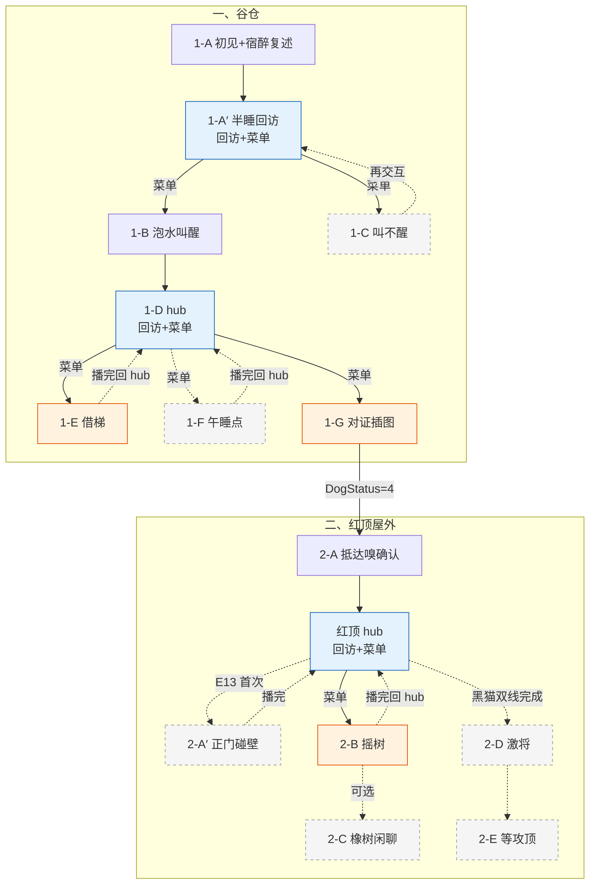

# 大黄 · 对话脚本（树状样章）

> **状态**：大黄对话**实施准稿**（以本树状脚本为准）。  
> **变量**：全局定义见 [17-全局游戏状态变量](../17-全局游戏状态变量.md)；本脚本只引用该表中的名，不另造变量。

---

## 流程总览

**一、谷仓**

1. 第一次见到大黄 → **1-A** 初见演出 + 宿醉复述乌鸦叼蛋 → 记 `DogStatus=2`
2. 之后再点大黄 → **1-A′** 半睡回访：先播固定回访，再出菜单——有泡水选递水进 **1-B**，没泡水选叫醒进 **1-C**
3. **1-B** 喂泡水 → 清醒 → **1-D hub**
4. **1-D hub**：每次先播固定回访，再出菜单——借梯 / 问草窝 / 对证石头
5. **1-G** 对证白石头 → 大黄嗅觉恢复 → `DogStatus=4` → 出发去红顶屋

**二、红顶屋外**

1. **2-A** 抵达必播（嗅确认蛋在屋里）→ **2-A′** 正门进不去（调查 E13 后一次性）
2. **红顶 hub**：下树线索不够 → 固定回访催查；线索够了 → 菜单进 **2-B** 摇树
3. **2-B** 摇树叫黑猫 → **2-C** 橡树下轮播闲聊（可选）
4. 黑猫案情线 + 薄荷鱼线都谈完 → **2-D** 大黄催、黑猫起身进猫门开窗
5. **2-E** 攻顶前大黄加油（一次性）

**二周目**：`NGPlus` → 四轮轮播，无推进。

变量写入见正文各节点【变量】；全局对照 [17 §17.8](../17-全局游戏状态变量.md#178-大黄树状脚本速查与样章对齐)。

### 分章流程图




**图例**：橙色 = 关键质询；蓝色 = hub（回访+菜单）；灰虚框 = 可选 / 一次性；虚线 = 非主链或播完回到 hub。

---

## 一、谷仓

---

### 1-A · 初见 + 半睡复述（仅首次）

> 〔系统注〕**E04** 不走线索大图；首段描述兼作初见演出。`DogStatus == 1` 时自动进入，**只播一次**。播完 `DogStatus=2`，之后交互改走 **1-A′**（不重复本段全文）。不设 `E04_`* bool（见 `17`）。

```text
1-A
│
├─ 描述：（谷仓墙根旁，一架短木梯侧倒在地，一只大黄色的狗半压在上面，低沉的鼾声带着哨音）
│  大黄：嗝——
│  大黄：谁……
│  玩家：淑芬的蛋不见了。你看到过什么吗？
│  描述：（大黄的耳朵动了一下，目光慢慢聚过来）
│  大黄：蛋……乌鸦……叼走了。
│  玩家：乌鸦？
│  大黄：嗯……飞到谷仓屋顶去了。我追了……跳不上去，只咬到空气。
│  描述：（大黄把脑袋重新压回前爪上，声音低下去）
│  大黄：我失职了……没有保护好淑芬的蛋。
│
└─ 【条件】（E06_ViewNeedLadder）
   玩家：你身下压着一架短木梯，能先挪一下吗？谷仓入口那道矮墙翻不过去。
   描述：（大黄迷迷糊糊蹬了下腿，短梯反而被压得更实）
   玩家：看来得把他叫醒。

→ 对话结束；下次交互进入「1-A′」

【变量】
· DogStatus = 2
```

---

### 1-A′ · 半睡回访

> 〔系统注〕`DogStatus == 2` 时，玩家再次靠近谷仓旁大黄进入本节点。先播【回访】，再出【菜单】分流至 `1-B` / `1-C`。

```text
1-A′
│
├─ 【回访】
│  描述：（大黄半睡半醒，耳朵动了一下又垂下去）
│  大黄：嗝……干嘛……
│
└─ 【菜单】
   「大黄，先喝点这个。」（E05_GrainSoakGet）→ 1-B
   「大黄，醒醒。」（!E05_GrainSoakGet）→ 1-C
```

---

### 1-B · 泡水叫醒

```text
1-B
│
└─ 玩家：大黄，先喝点这个。
   描述：（大黄眯着眼嗅了嗅，慢慢伸出舌头，喝了几口，停住，再喝）
   描述：（片刻后，大黄猛地甩了下脑袋——湿树叶从额头飞出去）
   大黄：呕——
   大黄：嗝——
   描述：（大黄使劲眨眼，目光开始聚焦）
   大黄：……我刚才说什么来着？
   玩家：你说乌鸦叼走了蛋，飞到谷仓屋顶。
   描述：（大黄低下头，耳朵耷拉着）
   大黄：对。我没拦住。
   描述：（大黄深吸一口气，四肢从梯子上撑起来，摇摇晃晃站稳）

→ 1-D

【变量】
· DogStatus = 3
```

---

### 1-C · 叫不醒

```text
1-C
│
├─ 玩家：大黄，醒醒。
│  描述：（大黄哼了一声，把头埋进前爪里）
│  大黄：嗝……别吵……
│
├─ 【条件】（!E06_ViewNeedLadder）
│  「这样叫不醒。得找点能让他清醒的东西。」
│
└─ 【条件】（E06_ViewNeedLadder）
   「这样叫不醒。得先让他清醒过来，短梯才借得出来。」

→ 回「1-A′」；再点击：仍无 E05 则再进 1-C，有 E05 则菜单进 1-B
```

---

### 1-D · 清醒回访 hub

```text
1-D
│
├─ 【回访】
│  大黄：我清醒多了。刚才说的是真的——乌鸦叼着那个白色圆东西，飞到谷仓屋顶去了。
│  描述：（大黄低头看着地面，爪尖刮了下泥）
│  大黄：我没拦住。这事得查清楚。
│
└─ 【菜单】
   「梯子能借我吗？」（E06_ViewNeedLadder && !E06_LadderBorrowed）→ 1-E
   「谷仓那草窝是谁的？」（E07_ViewNapSpot）→ 1-F
   「这是你追的蛋吗？」（E10_NoteIllust）→ 1-G
```

---

### 1-E · 索要木梯

```text
1-E
│
└─ 玩家：大黄，梯子能借我吗？乌鸦在谷仓顶上，我得先翻过入口那道小围墙。
   大黄：梯子？
   描述：（大黄扭头看向身侧那架侧倒的木梯）
   大黄：哦。对哦。拿去吧。
   描述：（大黄用前爪把木梯往玩家方向推了推）
   大黄：架稳了再翻。别摔着。

→ 1-D

【变量】
· E06_LadderBorrowed = true
```

> 〔系统注〕持梯回 **E06** 架设 → `E06_LadderPlaced = true`（环境交互，见 `13` E06）。

---

### 1-F · 午睡点碎片

```text
1-F
│
└─ 玩家：谷仓角落有一片被压扁的草窝，你知道是哪个动物的吗？
   大黄：谷仓角落……
   描述：（大黄皱起眉头，努力回想）
   大黄：我嚎叫那会儿脑子糊着……好像看见两个灰乎乎的东西，抱着什么往红顶屋那边跑。太快了，没看清。
   玩家：两个灰乎乎的……
   大黄：嗯。也可能是我那两天喝糊涂了产生的幻觉，就那么一眼。

→ 1-D
```

---

### 1-G · 展示插图

```text
1-G
│
└─ 玩家：大黄，你看这个——是不是你那天追的蛋？
   描述：（大黄低头凑近，仔细盯着摊开的笔记本插图）
   大黄：这是……什么？
   描述：（大黄眼睛睁大，头伸得更近）
   大黄：一块石头？
   描述：（大黄抬起脑袋，僵在那里）
   大黄：……这跟乌鸦叼走的……形状差不多。
   玩家：乌鸦一直守着这块石头，说是他的部落图腾宝石。
   描述：（大黄盯着插图，一动不动，像是脑子里有什么齿轮咬住了）
   大黄：所以乌鸦叼走的……不是淑芬的蛋？
   大黄：……我
   大黄：那我不是废柴保安！！
   描述：（尾巴猛地甩动起来，停不下来）
   大黄：蛋一定还在！！
   描述：（大黄一个激灵，深吸一口气）
   描述：（在某个方向停下来，神情郑重）
   大黄：蛋气味在那边。红顶屋那一片。我先走一步。

→ 二、红顶屋外

【变量】
· DogStatus = 4
```

> 任务点迁红顶屋外。

---

## 二、红顶屋外

---

### 2-A · 抵达必播

```text
2-A
│
└─ 描述：（大黄仰头嗅了嗅，点头）
   大黄：没错——就在这屋里。

【变量】
· RedRoof_IntroShown = true
```

---

### 2-A′ · 大门碰壁（一次性）

```text
2-A′
│
└─ 玩家：正门进不去。
   大黄：……那怎么办啊。侦探你再去看看，我一会儿也试试。

【变量】
· RedRoof_DoorHintShown = true
```

> 〔系统注〕由 **E13** 首次调查触发；`E13_ViewDoorBlocked` 在环境交互时写入。

---

### 红顶屋外 hub

```text
红顶屋外 hub
│
├─ 【回访】（!(E13_ViewDoorBlocked && TreeClueCount >= 2)）
│  大黄：快看看，蛋一定还在里面。
│
└─ 【菜单】
   「红屋顶里住的别的动物？」（E13_ViewDoorBlocked && TreeClueCount >= 2）→ 2-B
```

---

### 2-B · 摇树召唤

```text
2-B
│
└─ 玩家：这里有一扇精美的小门，还有一撮动物的毛，红屋顶里还住着别的动物？
   描述：（大黄愣了一下，猛地用爪子拍了下自己脑门）
   大黄：哎哟！我这脑子，还是酒喝大了！
   玩家：你想起什么了？
   大黄：有一只猫！那只傲慢的黑猫！他有专属猫门，钥匙就挂在脖子上！
   玩家：他在哪儿？
   大黄：大橡树上！
   描述：（双爪抵住树干，猛地摇晃）
   大黄：猫大爷！下来！这事得你出马！

→ 结束

【变量】
· Dog_BlackCatSummoned = true
```

---

### 2-C · 大橡树下闲聊

```text
2-C
│
└─ 【轮播】
   ├─ 玩家：大黄，你认识那只黑猫很久了吗？
   │  大黄：挺久的。他刚来的时候……比我一只爪子还小。
   │  描述：（大黄往下看了看自己的爪子）
   │  大黄：那会儿什么都不懂，连怎么爬树都不会。我教过他一次。
   │  玩家：他学会了吗？
   │  大黄：学会了。后来他就不理我了。
   │
   ├─ 玩家：他小时候怕什么吗？
   │  大黄：怕下雨。每次打雷，他就跑来我狗窝旁边蹲着。我说进来吧，他说本喵只是路过，然后在门口站了整整一夜。
   │  描述：（大黄挠挠耳朵）
   │  大黄：我后来提过一次，他说从来没进过我狗窝、那种地方。就是这样的。
   │
   ├─ 描述：（大黄看着黑猫蹲着的方向）
   │  大黄：他不走。
   │  玩家：什么？
   │  大黄：我说，他没走。换成别的猫，被人从树上晃下来，早就走了。
   │  描述：（大黄若无其事地往旁边挪了半步）
   │  大黄：他在听的。就是不想让人看出来他在听。
   │
   └─ 描述：（大黄坐在橡树旁，抬头嗅了嗅红顶屋方向）
      大黄：蛋还在里面。我守着。
```

---

### 2-D · 激将黑猫（三人同场）

> 〔系统注〕【案情汇报线】+【薄荷鱼线】均完成，黑猫仍蹲树未起身时触发。  
> **信息边界**：软垫被夺、按摩骗局——**黑猫**在摇树现身段已自述（大黄在场听见过，但案发时在宿醉，**未目击**）。本段大黄**不得**复述软垫/按摩细节；起身动机由黑猫自己收口。

```text
2-D
│
└─ 大黄：猫大爷，该动身了吧？
   描述：（黑猫非常缓慢地从蹲位站起来）
   描述：（黑猫用眼神冻住大黄——大黄讪讪地把头转开）
   黑猫：本喵不是因为那只发疯母鸡。也不是因为这条蠢狗指使。
   描述：（黑猫低头，用嘴叼起薄荷鱼）
   黑猫：谈够了。本喵要亲眼进屋——那颗蛋还在不在，本喵也要确认。
   描述：（黑猫走向猫门方向，停住，回头）
   黑猫：你不许走本喵的门。你要进去就去爬窗户吧。本喵去给你开窗。
   描述：（黑猫利落地钻进猫门）
   描述：（片刻后，屋顶天窗传来一声清脆的啪嗒，红屋顶二楼的窗子被从内推开）

→ 结束

【变量】
· BlackCat_Entered = true
```

> 〔系统注〕天窗攻顶路线解锁；之后可触发 **2-E**。

---

### 2-E · 等待攻顶（一次性）

```text
2-E
│
└─ 描述：（大黄仰头看向红顶屋屋顶，尾巴轻轻摇着）
   大黄：加油。我等着真相。

【变量】
· RedRoof_RoofWaitShown = true
```

---

## 二周目

```text
NGPlus 回访
│
└─ 【轮播】
   ├─ 大黄：巡逻中。一切正常。
   │
   ├─ 玩家：大黄，那块石头最后怎么了？
   │  大黄：还在乌鸦那儿呢。我问过它，它说那是图腾宝石，意义非凡。
   │  描述：（大黄挠了挠耳朵）
   │  大黄：……随它去吧。
   │
   ├─ 大黄：我想……下次再见到苹果渣，就不喝了。
   │  描述：（停顿）
   │  大黄：我是保安。不是酒鬼。
   │
   └─ 玩家：大黄，以后还会有蛋失踪吗？
      大黄：不会了。
      描述：（大黄低头看了看项圈，抬头）
      大黄：我的鼻子好用着呢。
```

---

## 条件覆盖自检

完整变量读写见 [17-全局游戏状态变量 §17.8](../17-全局游戏状态变量.md#178-大黄树状脚本速查与样章对齐)。

**本脚本【变量】块（9 处）**：`1-A` `1-B` `1-G` 写 `DogStatus` · `1-E` `E06_LadderBorrowed` · `2-A` `RedRoof_IntroShown` · `2-A′` `RedRoof_DoorHintShown` · `2-B` `Dog_BlackCatSummoned` · `2-D` `BlackCat_Entered` · `2-E` `RedRoof_RoofWaitShown`。其余节点无写入。

---

*关联文档：[17-全局游戏状态变量](../17-全局游戏状态变量.md)、[13-玩家线索与交互点总表](../13-玩家线索与交互点总表.md)