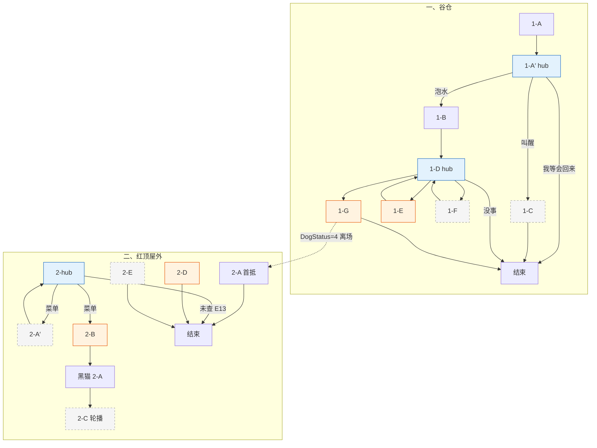

# 大黄 · 对话脚本（树状样章）

> **状态**：大黄对话**实施准稿**（以本树状脚本为准）。  
> **变量**：全局定义见 [17-全局游戏状态变量](../17-全局游戏状态变量.md)；本脚本只引用该表中的名，不另造变量。  
> **描述行**：text 树块内一律 `描述：（……）`，见 [18 §18.2](../18-树状对话脚本生成方法.md)。  
> **方法**：树状脚本生产流程见 [18-树状对话脚本生成方法](../18-树状对话脚本生成方法.md)。

---

## 流程总览

**一、谷仓**

1. **1-A** 初见 + 宿醉复述 → `DogStatus=2` → **1-A′【回访】+【菜单】**
2. **1-A′**【回访】+【菜单】：泡水 **1-B** / 叫醒 **1-C** / 「我等会回来」结束
3. **1-C** 叫不醒 → **对话结束**（再点回 **1-A′**）
4. **1-B** 泡水叫醒 → **1-D【回访】+【菜单】**
5. **1-D** hub：子项 **1-E** / **1-F** 播完回【回访】+【菜单】；「目前没什么事了」结束
6. **1-G** 对证白石头 → `DogStatus=4` → **对话结束**（大黄离场；谷仓不可再点）。**1-F** 第一章漏问可在 **2-hub**【菜单】补问（摇树前）

**二、红顶屋外**

> 点大黄时的**入口路由**（`DogStatus==4`，按序匹配第一条）见各节点〔系统注〕。

1. **2-A** 首次抵达（`!RedRoof_IntroShown`）→ **对话结束**
2. **2-hub** 黑猫未召唤（`!Dog_BlackCatSummoned`）：未查 **E13** 催查后结束；已查 **E13** 则【回访】+【菜单】→ **2-B** / **2-A′** / **1-F** / 结束
3. **2-B** 摇树 → **黑猫 `2-A`**（三人同场）；之后**主交互在黑猫**
4. **2-C** 黑猫已现身、未进屋：【轮播】闲聊
5. **2-D** 双线完成激将（**黑猫脚本触发**，非大黄点击入口）→ **对话结束**
6. **2-E** 攻顶前加油（`BlackCat_Entered && !RedRoof_RoofWaitShown`，一次性）→ **对话结束**

**二周目**：`NGPlus` → 四轮轮播，无推进。

变量写入见正文各节点【变量】；全局对照 [17 §17.8](../17-全局游戏状态变量.md#178-大黄树状脚本速查与样章对齐)。

### 分章流程图




**图例**：橙色 = 关键质询 / 切场；蓝色 = hub。hub 一律 **【回访】+【菜单】** 同屏；较长演出写在上一节点末尾。

**对话结束**：须离场、须找线索、主动告辞、或 NPC 换位置 / 切交互对象时结束；能连下一节点则不写「对话结束」。

---

## 一、谷仓

> 〔系统注〕谷仓旁点大黄，**按序匹配**（`DogStatus==4` 时大黄已离场，**不可交互**）：
>
> 1. `DogStatus==1` → **1-A** → **1-A′**
> 2. `DogStatus==2` → **1-A′**
> 3. `DogStatus==3` → **1-D**

---

### 1-A · 初见 + 半睡复述（仅首次）

> 〔系统注〕**E04** 不走线索大图；首段描述兼作初见演出。`DogStatus == 1` 时自动进入，**只播一次**。播完 `DogStatus=2` → **1-A′【回访】+【菜单】**。不设 `E04_`* bool（见 `17`）。

```text
1-A
│
├─ 描述：（谷仓墙根旁，一架短木梯侧倒在地，一只大黄色的狗半压在上面，低沉的鼾声带着哨音）
│  大黄：嗝——
│  大黄：谁……
│  玩家：淑芬的蛋不见了。你看到过什么吗？
│  描述：（大黄的耳朵动了一下，目光慢慢聚过来）
│  大黄：蛋……乌鸦……叼走了。
│  玩家：乌鸦？
│  大黄：嗯……飞到谷仓屋顶去了。我追了……跳不上去，只咬到空气。
│  描述：（大黄把脑袋重新压回前爪上，声音低下去）
│  大黄：我失职了……没有保护好淑芬的蛋。
│
└─ 【条件】（E06_ViewNeedLadder）
   玩家：你身下压着一架短木梯，能先挪一下吗？谷仓入口那道矮墙翻不过去。
   描述：（大黄迷迷糊糊蹬了下腿，短梯反而被压得更实）
   玩家：看来得把他叫醒。

→ 1-A′【回访】+【菜单】

【变量】
· DogStatus = 2
```

---

### 1-A′ · 半睡 hub

> 〔系统注〕`DogStatus == 2`。先播【回访】，同屏出【菜单】。

```text
1-A′
│
├─ 【回访】
│  大黄：嗝……
│
└─ 【菜单】
   「大黄，先喝点这个。」（E05_GrainSoakGet）→ 1-B
   「大黄，醒醒。」（!E05_GrainSoakGet）→ 1-C
   「我等会回来。」→ 对话结束
```

---

### 1-B · 泡水叫醒

> 〔系统注〕`DogStatus == 2` && `E05_GrainSoakGet`。末尾收清醒演出 → **1-D【回访】+【菜单】**。

```text
1-B
│
└─ 玩家：大黄，先喝点这个。
   描述：（大黄眯着眼嗅了嗅，慢慢伸出舌头，喝了几口，停住，再喝）
   描述：（片刻后，大黄猛地甩了下脑袋——湿树叶从额头飞出去）
   大黄：呕——
   大黄：嗝——
   描述：（大黄使劲眨眼，目光开始聚焦）
   描述：（四肢从梯子上撑起来，摇摇晃晃站稳）
   大黄：……头脑清楚多了。

→ 1-D【回访】+【菜单】

【变量】
· DogStatus = 3
```

---

### 1-C · 叫不醒

> 〔系统注〕`DogStatus == 2` && `!E05_GrainSoakGet`。播完**对话结束**；玩家再点大黄回 **1-A′**。

```text
1-C
│
├─ 玩家：大黄，醒醒。
│  描述：（大黄哼了一声，把头埋进前爪里）
│  大黄：嗝……别吵……
│
├─ 【条件】（!E06_ViewNeedLadder）
│  玩家：这样叫不醒。得找点能让他清醒的东西。
│
└─ 【条件】（E06_ViewNeedLadder）
   玩家：这样叫不醒。得先让他清醒过来，短梯才借得出来。

→ 对话结束
```

---

### 1-D · 清醒 hub

> 〔系统注〕`DogStatus == 3`。先播【回访】，同屏出【菜单】。**1-G** 播完**对话结束**。

```text
1-D
│
├─ 【回访】
│  大黄：你还有什么事吗？
│
└─ 【菜单】
   「梯子能借我吗？」（E06_ViewNeedLadder && !E06_LadderBorrowed）→ 1-E
   「谷仓那草窝是谁的？」（E07_ViewNapSpot && !E07_NapSpotAsked）→ 1-F
   「这是你追的蛋吗？」（E10_ViewWhiteStone）→ 1-G
   「目前没什么事了。」→ 对话结束
```

---

### 1-E · 索要木梯

> 〔系统注〕`DogStatus==3` && `E06_ViewNeedLadder` && `!E06_LadderBorrowed`（**1-D**【菜单】）。播毕 `DogStatus` 仍为 **3**。

```text
1-E
│
└─ 玩家：大黄，梯子能借我吗？入口那道小围墙，我得翻过去。
   大黄：梯子？
   描述：（大黄扭头看向身侧那架侧倒的木梯）
   大黄：哦。对哦。拿去吧。
   描述：（大黄用前爪把木梯往玩家方向推了推）
   大黄：架稳了再翻。别摔着。

→ 1-D【回访】+【菜单】（DogStatus==3）

【变量】
· E06_LadderBorrowed = true
```

> 〔系统注〕持梯回 **E06** 架设 → `E06_LadderPlaced = true`（环境交互，见 `13` E06）。

---

### 1-F · 午睡点碎片

> 〔系统注〕`E07_ViewNapSpot && !E07_NapSpotAsked`。入口：**1-D**（`DogStatus==3`）或 **2-hub**（`DogStatus==4`）【菜单】。播毕按 `DogStatus` 回 hub：**3** → **1-D**，**4** → **2-hub**。**2-C** 及摇树后不再补问。

```text
1-F
│
└─ 玩家：谷仓角落有一片被压扁的草窝，你知道是哪个动物的吗？
   大黄：谷仓角落……
   描述：（大黄皱起眉头，努力回想）
   大黄：前两天好像看见两个灰乎乎的小东西，太快了，没看清。
   大黄：也可能是我那两天喝糊涂了。

→ 1-D【回访】+【菜单】（DogStatus==3）
→ 2-hub【回访】+【菜单】（DogStatus==4）

【变量】
· E07_NapSpotAsked = true
```

---

### 1-G · 展示插图

> 〔系统注〕`DogStatus==3` && `E10_ViewWhiteStone`（**1-D**【菜单】）。

```text
1-G
│
└─ 玩家：大黄，你看这个——是不是你那天追的蛋？
   描述：（大黄低头凑近，仔细盯着摊开的笔记本插图）
   大黄：这是……什么？
   描述：（大黄眼睛睁大，头伸得更近）
   大黄：一块石头？
   描述：（大黄抬起脑袋，僵在那里）
   大黄：……这跟乌鸦叼走的……形状差不多。
   玩家：乌鸦一直守着这块石头，说是他的部落图腾宝石。
   描述：（大黄盯着插图，一动不动，像是脑子里有什么齿轮咬住了）
   大黄：所以乌鸦叼走的……不是淑芬的蛋？
   大黄：……我
   大黄：那我不是废柴保安！！
   描述：（尾巴猛地甩动起来，停不下来）
   大黄：蛋一定还在！！
   描述：（大黄一个激灵，深吸一口气）
   描述：（在某个方向停下来，神情郑重）
   大黄：蛋气味在那边。红顶屋那一片。我先走一步。

→ 对话结束

【变量】
· DogStatus = 4
```

> 〔系统注〕大黄离场；玩家任务点迁红顶屋外。谷仓旁大黄**不可再交互**。下次在红顶屋外点大黄走 **2-A**。

---

## 二、红顶屋外

> 〔系统注〕`DogStatus == 4` 时点大黄，**按序匹配第一条**：
>
> 1. `NGPlus` → **NGPlus 回访**
> 2. `!RedRoof_IntroShown` → **2-A**
> 3. `Dog_BlackCatSummoned && BlackCat_Entered && !RedRoof_RoofWaitShown` → **2-E**
> 4. `Dog_BlackCatSummoned && !BlackCat_Entered` → **2-C**
> 5. `!Dog_BlackCatSummoned` → **2-hub**
> 6. `Dog_BlackCatSummoned && BlackCat_Entered && RedRoof_RoofWaitShown` → **2-C**（攻顶后轮播）

---

### 2-A · 首次抵达

> 〔系统注〕`DogStatus == 4` && `!RedRoof_IntroShown`。红顶屋外**第一次**点大黄。

```text
2-A
│
└─ 描述：（大黄在红顶屋外站定，尾巴轻轻绷着）
   大黄：就是这儿。

→ 对话结束

【变量】
· RedRoof_IntroShown = true
```

---

### 2-hub · 红顶屋外（黑猫未召唤）

> 〔系统注〕`DogStatus == 4` && `!Dog_BlackCatSummoned`。
>
> - `!E13_ViewDoorBlocked`：尚未调查正门，只播催查【回访】后**对话结束**。
> - `E13_ViewDoorBlocked`：【回访】+【菜单】同屏。回访不读 `TreeClueCount`；「摇树」项须 `TreeClueCount >= 2`（**E14–E16 / E28** 任意两项）。「正门进不去」项须 `!RedRoof_DoorHintShown`。

```text
2-hub
│
├─ 【条件】（!E13_ViewDoorBlocked）
│  【回访】
│  大黄：你先去看看那扇门。
│  → 对话结束
│
├─ 【回访】（E13_ViewDoorBlocked）
│  大黄：查到什么了吗？
│
└─ 【菜单】（E13_ViewDoorBlocked）
   「正门进不去。」（!RedRoof_DoorHintShown）→ 2-A′
   「红屋顶里还住着别的动物？」（TreeClueCount >= 2）→ 2-B
   「谷仓那草窝是谁的？」（E07_ViewNapSpot && !E07_NapSpotAsked）→ 1-F
   「目前没查到什么。」→ 对话结束
```

> 〔系统注〕`E13` 已查但 `TreeClueCount < 2` 时，【回访】与【菜单】仍同屏；摇树项隐藏。退出项「目前没查到什么。」回应回访「查到什么了吗？」——与 **1-D**「目前没什么事了。」（回应「你还有什么事吗？」）不同，勿混用。

---

### 2-A′ · 大门碰壁（一次性）

```text
2-A′
│
└─ 玩家：正门进不去。
   大黄：……那怎么办啊。侦探你再去看看，我一会儿也试试。

→ 2-hub【回访】+【菜单】（DogStatus==4 && !Dog_BlackCatSummoned）

【变量】
· RedRoof_DoorHintShown = true
```

> 〔系统注〕`DogStatus==4` && `E13_ViewDoorBlocked` && `!RedRoof_DoorHintShown`（**2-hub**【菜单】）。`E13_ViewDoorBlocked` 在 **E13** 环境交互时写入。

---

### 2-B · 摇树召唤

> 〔系统注〕`DogStatus==4` && `E13_ViewDoorBlocked` && `TreeClueCount >= 2` && `!Dog_BlackCatSummoned`（**2-hub**【菜单】）→ 黑猫 **2-A**。

```text
2-B
│
└─ 玩家：这里有一扇精美的小门，还有一撮动物的毛，红屋顶里还住着别的动物？
   描述：（大黄愣了一下，猛地用爪子拍了下自己脑门）
   大黄：哎哟！我这脑子，还是酒喝大了！
   玩家：你想起什么了？
   大黄：有一只猫！那只傲慢的黑猫！他有专属猫门，钥匙就挂在脖子上！
   玩家：他在哪儿？
   大黄：大橡树上！
   描述：（双爪抵住树干，猛地摇晃）
   大黄：猫大爷！下来！这事得你出马！

→ 黑猫 **2-A**（见 [黑猫-对话脚本-树状](./黑猫-对话脚本-树状.md)）

【变量】
· Dog_BlackCatSummoned = true
```

> 〔系统注〕**2-A** 播毕后，**主交互切至黑猫**（**2-hub** 谈判菜单）。再点大黄走 **2-C**。

---

### 2-C · 大橡树下闲聊

> 〔系统注〕`DogStatus==4` && `Dog_BlackCatSummoned` &&（`!BlackCat_Entered` **或** `RedRoof_RoofWaitShown`）。入口路由 step **3**（黑猫未进屋）或 step **5**（**2-E** 已播）。等权重【轮播】，无推进。

```text
2-C
│
└─ 【轮播】
   ├─ 玩家：大黄，你认识那只黑猫很久了吗？
   │  大黄：挺久的。他刚来的时候……比我一只爪子还小。
   │  描述：（大黄往下看了看自己的爪子）
   │  大黄：那会儿什么都不懂，连怎么爬树都不会。我教过他一次。
   │  玩家：他学会了吗？
   │  大黄：学会了。后来他就不理我了。
   │
   ├─ 玩家：他小时候怕什么吗？
   │  大黄：怕下雨。每次打雷，他就跑来我狗窝旁边蹲着。我说进来吧，他说本喵只是路过，然后在门口站了整整一夜。
   │  描述：（大黄挠挠耳朵）
   │  大黄：我后来提过一次，他说从来没进过我狗窝、那种地方。就是这样的。
   │
   ├─ 描述：（大黄看着黑猫蹲着的方向）
   │  大黄：他不走。
   │  玩家：什么？
   │  大黄：我说，他没走。换成别的猫，被人从树上晃下来，早就走了。
   │  描述：（大黄若无其事地往旁边挪了半步）
   │  大黄：他在听的。就是不想让人看出来他在听。
   │
   └─ 描述：（大黄坐在橡树旁，望向红顶屋方向）
      大黄：我守着。

→ 对话结束
```

---

### 2-D · 激将黑猫（三人同场）

> 〔系统注〕`DogStatus==4`。双路谈判完成后点**黑猫**走路由直进 [黑猫 **2-E**](./黑猫-对话脚本-树状.md)；`BlackCat_Entered` 在该节点写入。本节点不重复正文。

```text
2-D
│
└─ → 黑猫 2-E

→ 对话结束
```

> 〔系统注〕二层窗攻顶路线解锁。攻顶前点大黄可触发 **2-E**（一次性）。

---

### 2-E · 等待攻顶（一次性）

> 〔系统注〕`DogStatus==4` && `Dog_BlackCatSummoned && BlackCat_Entered && !RedRoof_RoofWaitShown`。入口路由 step **2**。

```text
2-E
│
└─ 描述：（大黄仰头看向红顶屋屋顶，尾巴轻轻摇着）
   大黄：加油。我等着真相。

→ 对话结束

【变量】
· RedRoof_RoofWaitShown = true
```

---

## 二周目

> 〔系统注〕`NGPlus`；入口路由 step **0**（优先于 `DogStatus==4` 各节点）。

```text
NGPlus 回访
│
└─ 【轮播】
   ├─ 大黄：巡逻中。一切正常。
   │
   ├─ 玩家：大黄，那块石头最后怎么了？
   │  大黄：还在乌鸦那儿呢。我问过它，它说那是图腾宝石，意义非凡。
   │  描述：（大黄挠了挠耳朵）
   │  大黄：……随它去吧。
   │
   ├─ 大黄：我想……下次再见到苹果渣，就不喝了。
   │  描述：（停顿）
   │  大黄：我是保安。不是酒鬼。
   │
   └─ 玩家：大黄，以后还会有蛋失踪吗？
      大黄：不会了。
      描述：（大黄低头看了看项圈，抬头）
      大黄：我的鼻子好用着呢。
```

---

## 条件覆盖自检

### 入口路由（变量限定）

**谷仓**（`DogStatus<4`）：`1`→**1-A** · `2`→**1-A′** · `3`→**1-D**

**红顶**（`DogStatus==4`）：`NGPlus`→轮播 · `!RedRoof_IntroShown`→**2-A** · `Dog_BlackCatSummoned&&BlackCat_Entered&&!RedRoof_RoofWaitShown`→**2-E** · `Dog_BlackCatSummoned&&!BlackCat_Entered`→**2-C** · `!Dog_BlackCatSummoned`→**2-hub** · `Dog_BlackCatSummoned&&BlackCat_Entered&&RedRoof_RoofWaitShown`→**2-C**

### 节点 / 菜单 / 返链（变量限定）


| 节点           | 进入（读取）                                                                   | 菜单项 / 分支                                                                                    | 下一跳（写入后）                                                       |
| ------------ | ------------------------------------------------------------------------ | ------------------------------------------------------------------------------------------- | -------------------------------------------------------------- |
| **1-A**      | `DogStatus==1`                                                           | —                                                                                           | `DogStatus=2` → **1-A′**                                       |
| **1-A′**     | `DogStatus==2`                                                           | `E05`→**1-B** · `!E05`→**1-C** · 告辞→结束                                                      | —                                                              |
| **1-B**      | `DogStatus==2` && `E05`                                                  | —                                                                                           | `DogStatus=3` → **1-D**                                        |
| **1-C**      | `DogStatus==2` && `!E05`                                                 | `!E06` / `E06` OS                                                                           | 结束                                                             |
| **1-D**      | `DogStatus==3`                                                           | `E06&&!借梯`→**1-E** · `E07&&!问过`→**1-F** · `E10`→**1-G** · 告辞→结束                             | 子项回 **1-D**                                                    |
| **1-E**      | `DogStatus==3` && `E06` && `!借梯`                                         | —                                                                                           | `E06_LadderBorrowed` → **1-D**                                 |
| **1-F**      | `E07` && `!E07_NapSpotAsked`                                             | —                                                                                           | `E07_NapSpotAsked` → **1-D**（`DogStatus==3`）或 **2-hub**（`==4`） |
| **1-G**      | `DogStatus==3` && `E10`                                                  | —                                                                                           | `DogStatus=4` → 结束                                             |
| **2-A**      | `DogStatus==4` && `!RedRoof_IntroShown`                                  | —                                                                                           | `RedRoof_IntroShown` → 结束                                      |
| **2-hub**    | `DogStatus==4` && `!Dog_BlackCatSummoned`                                | `!E13`→回访结束 · `E13`→菜单                                                                      | 见下                                                             |
| **2-hub** 菜单 | `E13`                                                                    | `!RedRoof_DoorHintShown`→**2-A′** · `TreeClueCount>=2`→**2-B** · `E07&&!问过`→**1-F** · 退出→结束 | 回 **2-hub** / **1-F** 返链                                       |
| **2-A′**     | `DogStatus==4` && `E13` && `!RedRoof_DoorHintShown`                        | —                                                                                           | `RedRoof_DoorHintShown` → **2-hub**                            |
| **2-B**      | `DogStatus==4` && `E13` && `TreeClueCount>=2` && `!Dog_BlackCatSummoned` | —                                                                                           | `Dog_BlackCatSummoned` → 黑猫 **2-A**                            |
| **2-C**      | 见入口路由 step **3** / **5**                                                 | 【轮播】                                                                                        | 结束                                                             |
| **2-D**      | 黑猫 **2-E**（`CaseLineDone&&MintFishLineDone&&!BlackCat_Entered`）         | —                                                                                           | `BlackCat_Entered`（黑猫 **2-E** 写入）→ 结束                        |
| **2-E**      | 见入口路由 step **2**                                                         | —                                                                                           | `RedRoof_RoofWaitShown` → 结束                                   |
| **NGPlus**   | `NGPlus`                                                                 | 【轮播】                                                                                        | —                                                              |


**对话结束**：须离场找线索（**2-hub** `!E13`）、主动告辞（**1-A′**「我等会回来」· **1-D**「目前没什么事了」· **2-hub**「目前没查到什么。」）、NPC 离场（**1-G**）、切交互对象（**2-B**→黑猫）、演出切场（**2-D** / **2-E** / **2-C**）。

**hub 口径**：**【回访】+【菜单】** 同屏；`TreeClueCount` 等只锁菜单项，不拆回访分支。

完整变量读写见 [17-全局游戏状态变量 §17.8](../17-全局游戏状态变量.md#178-大黄树状脚本速查与样章对齐)。

**本脚本【变量】块（9 处）**：`1-A` `1-B` `1-G` 写 `DogStatus` · `1-E` `E06_LadderBorrowed` · `1-F` `E07_NapSpotAsked` · `2-A` `RedRoof_IntroShown` · `2-A′` `RedRoof_DoorHintShown` · `2-B` `Dog_BlackCatSummoned` · `2-E` `RedRoof_RoofWaitShown`（`BlackCat_Entered` 见黑猫 **2-E**）。

---

*关联文档：[17-全局游戏状态变量](../17-全局游戏状态变量.md)、[13-玩家线索与交互点总表](../13-玩家线索与交互点总表.md)*