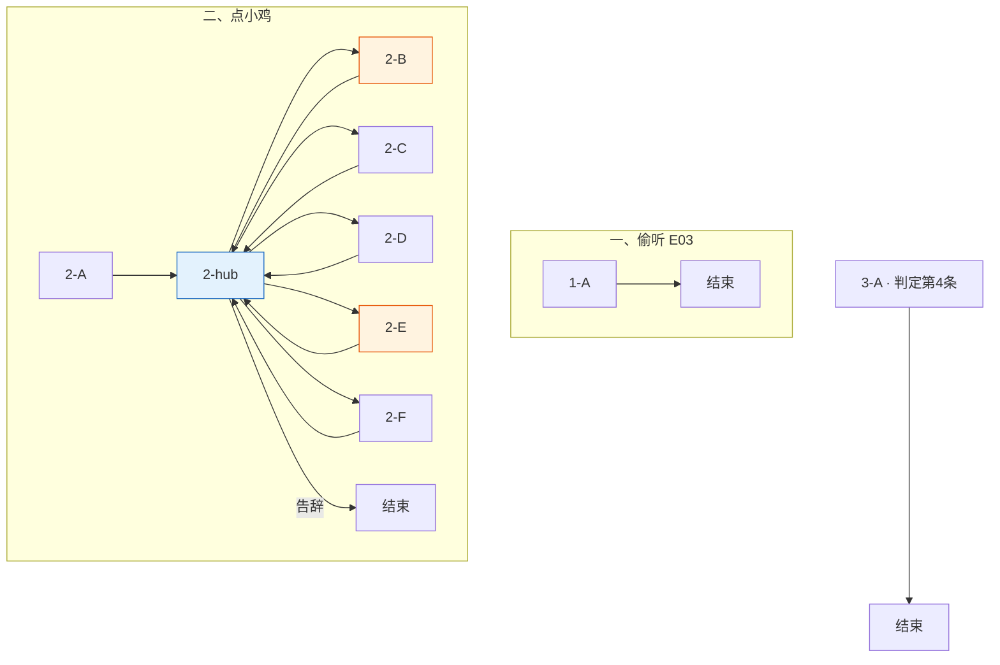

# 小鸡侦探团 · 对话脚本（树状）

> **状态**：小鸡侦探团对话**实施准稿**（以本树状脚本为准）。  
> **变量**：见 [17-全局游戏状态变量](../17-全局游戏状态变量.md)；本脚本只引用该表，不另造变量。  
> **描述行**：text 树块内一律 `描述：（……）`，见 [18 §18.2](../18-树状对话脚本生成方法.md)。  
> **说话方**：**阿满** / **米粒** / **豆豆** / **瓜子**，全程使用此四名。  
> **方法**：[18](../18-树状对话脚本生成方法.md) · [16](../16-NPC对话脚本书写守则.md)。

---

## 流程总览

**一、鸡舍周边 · 偷听（E03）**

1. **1-A** 身后偷听 → `E03_Overheard` → **对话结束**

**二、主交互（点小鸡侦探团）**

> 点小鸡时**入口判定**（按序匹配第一条）见各节点〔系统注〕。

1. **2-A** 首访 → `ChickStatus=1` → **2-hub【回访】+【菜单】**
2. **2-hub** 点小鸡首进播 Status【回访】+【菜单】；子项 **2-B**～**2-F** 播完回 hub 短【回访】+【菜单】（由出口路径区分，不设 bool）；告辞结束
3. **2-B** 水怪说质询 → `ChickStatus=2` → **2-hub【回访】+【菜单】**
4. **2-E** E10 质询招供 → `ChickStatus=3` → **2-hub【回访】+【菜单】**

**三、第二章 · 愧疚待命（点小鸡）**

- **3-A**【轮播】一次性（`DogStatus==4 && ChickStatus==3 && !Chick_Chapter2GuiltShown`）→ 结束

**二周目**：`NGPlus && !Chick_NGPlusShown` → NGPlus 一次性 → 结束；再点 → NGPlus【轮播】

> 小鸡**无路过 trigger**；除 **E03** 环境点（**点击交互**，非强制播）外，全线为**点小鸡**播对话。

变量写入见各节点【变量】；全局对照 [17 §17.10](../17-全局游戏状态变量.md#1710-小鸡侦探团树状脚本速查)。

### 分章流程图




**图例**：橙色 = 关键质询；蓝色 = hub（首进 Status【回访】+【菜单】；子项返回短【回访】+【菜单】）。

**对话结束**：偷听（E03 环境）、告辞、**3-A** 一次性、NGPlus 一次性后结束；子项返回 **2-hub**【回访】+【菜单】。

---

## 一、鸡舍周边 · 偷听点

> 〔系统注〕**E03** 环境点（非点小鸡）。玩家进入小鸡圈子**背后**范围后**点击交互键**播 **1-A**（非强制播）。`!E03_Overheard` 只播一次。偷听段玩家无台词。

---

### 1-A · 身后偷听（E03）

> 〔系统注〕播毕写 `E03_Overheard`（`ChickTraceCount` 由环境侧 +1）。

```text
1-A
│
└─ 豆豆：（压声）昨晚那声音……肯定是水怪……
   米粒：（压声）池塘那边……青蛙还说宝珠沉下去了……
   瓜子：（极小声）……可是大前天……明明是我们……
   阿满：（压声）瓜子！别说了！
   豆豆：（压声）那要是有人来问……
   阿满：（发抖）……水怪。从池塘来的。把蛋叼走了……
   阿满：（压声）只能是这样……不然弟弟怎么不见了……

→ 对话结束

【变量】
· E03_Overheard = true
```

---

## 二、主交互阶段

> 〔系统注〕点小鸡侦探团时，**按序匹配**：
>
> 1. `NGPlus && !Chick_NGPlusShown` → **NGPlus**（见 §二周目）
> 2. `NGPlus && Chick_NGPlusShown` → NGPlus【轮播】
> 3. `ChickStatus==0` → **2-A** → **2-hub**
> 4. `DogStatus==4 && ChickStatus==3 && !Chick_Chapter2GuiltShown` → **3-A** → **对话结束**
> 5. `ChickStatus>=1` → **2-hub**

---

### 2-A · 首次接触

> 〔系统注〕玩家主动搭话；小鸡被动、发虚。播毕 `ChickStatus=1` → **2-hub【回访】+【菜单】**。

```text
2-A
│
└─ 玩家：嘿，你们在干什么？
   描述：（四只小鸡挤在鸡舍边，纸板墨镜歪着）
   米粒：（小声）有人来了……
   豆豆：别、别看他……
   描述：（阿满往前挪了半步，又停住）
   阿满：……
   玩家：淑芬的蛋不见了，你们知道吗？
   描述：（阿满墨镜滑到喙尖）
   瓜子：（极小声）弟弟……
   阿满：（急）别乱叫！
   描述：（阿满把墨镜顶回去）
   阿满：我们……暗影侦探团……也在查。
   阿满：这事很大。你最好别乱插手。
   玩家：能告诉我点什么吗？
   描述：（豆豆拽了拽阿满翅膀）
   阿满：……
   阿满：内部情报。不能说。
   玩家：总得说点什么吧。
   描述：（米粒和豆豆对视一眼）
   米粒：……我们是侦探。
   豆豆：对。很忙的。
   描述：（瓜子低着头，喙动了动，没出声）

→ 2-hub【回访】+【菜单】

【变量】
· ChickStatus = 1
```

---

### 2-hub · 主菜单 hub

> 〔系统注〕**入口判定**进 hub 播 Status【回访】；**子项 2-B～2-F** 返 hub 播短【回访】——由路径区分，不设 bool。

```text
2-hub
│
├─ 【回访】（入口判定 / **2-A** 同链 · ChickStatus==1）
│  阿满：……在查。别碰我们的现场。
│
├─ 【回访】（入口判定 · ChickStatus==2）
│  阿满：池塘那边……去了吗？
│
├─ 【回访】（入口判定 · ChickStatus==3）
│  阿满：……外勤停了。有事快说。
│
├─ 【回访】（子项 **2-B**～**2-F** 返 hub）
│  描述：（四只小鸡又挤到一起）
│  阿满：……还说？
│
└─ 【菜单】
   「你们到底在搞什么鬼？」（ChickTraceCount>=2 && ChickStatus==1）→ 2-B
   「谷仓角落有个草窝，你们知道是谁的吗？」（E07_ViewNapSpot && !Chick_NapSpotAsked）→ 2-C
   「大黄宿醉成那样，有什么法子叫醒他吗？」（DogStatus==2 && !Chick_WakeDogHintShown）→ 2-D
   「这玩意儿，你们怎么解释？」（E10_ViewWhiteStone && ChickStatus<3）→ 2-E
   「我准备上谷仓顶找乌鸦。」（(DogStatus>=2 || E06_LadderBorrowed) && !E10_ViewWhiteStone && !Chick_RoofBlockShown）→ 2-F
   「没事，走了。」→ 对话结束
```

---

### 2-B · 水怪说质询

> 〔系统注〕`ChickTraceCount>=2 && ChickStatus==1`（招供 **2-E** 后 `ChickStatus=3` 不再出现）。情绪：防线崩掉，把心里真怕的水怪说出来。

```text
2-B
│
└─ 玩家：你们到底在搞什么鬼？
   描述：（阿满脖子一缩）
   阿满：……那是……
   米粒：工具……
   玩家：鸡舍边上那些乱七八糟的痕迹——和你们有关吧。
   描述：（四只小鸡挤得更紧）
   描述：（瓜子突然发抖）
   瓜子：（哭腔）水怪……水怪把弟弟……
   阿满：对！！就是水怪！！
   描述：（阿满朝池塘方向猛点头）
   阿满：三个脑袋！浑身绿色！
   阿满：从池塘来！把蛋拖进水里了！！
   玩家：你亲眼看见的？
   阿满：没、没看见……但肯定是！！
   阿满：昨晚外面那声音……青蛙也说了……
   阿满：（发颤）不然弟弟怎么不见了……
   豆豆：池塘那只青蛙肯定见过！！
   米粒：快去问他！！求你快去！！
   描述：（阿满墨镜歪了，顾不上扶）
   阿满：你去池塘……快去……
   阿满：（小声）找弟弟……

→ 2-hub【回访】+【菜单】

【变量】
· ChickStatus = 2
```

---

### 2-C · 谷仓午睡点（可选）

> 〔系统注〕`E07_ViewNapSpot`；一次性。

```text
2-C
│
└─ 玩家：谷仓角落有个草窝，你们知道是谁的吗？
   阿满：谷仓角落？
   描述：（阿满皱眉）
   阿满：我们没去过那边。
   米粒：不是我们的地盘。
   豆豆：对。

→ 2-hub【回访】+【菜单】

【变量】
· Chick_NapSpotAsked = true
```

---

### 2-D · 叫醒大黄（可选）

> 〔系统注〕`DogStatus==2`（大黄半睡）。**【谷物泡水】**位置提示；笔记本 D08 在本节点播毕写入（如尚未持有），E05 交互只在 D08 旁标注 **✓ get**。

```text
2-D
│
└─ 玩家：大黄宿醉成那样，有什么法子叫醒他吗？
   描述：（豆豆蹦了一下，墨镜歪了）
   豆豆：大黄叔叔？！他还没醒？！
   描述：（阿满按住豆豆）
   阿满：……嗯。
   描述：（阿满压低声音，翅膀尖抖了一下）
   阿满：鸡舍水槽边有老谷物泡水。
   阿满：他爱喝。灌下去就能醒。
   瓜子：（小声）……这次能帮上忙吗？

→ 2-hub【回访】+【菜单】

【变量】
· Chick_WakeDogHintShown = true
```

---

### 2-F · 拦路上顶（可选）

> 〔系统注〕一次性。玩家仍可上顶；瓜子差点漏嘴被阿满捂住。菜单锁：`DogStatus>=2`（大黄 **1-A** 后已入簿 D07）或 `E06_LadderBorrowed`，且 `!E10_ViewWhiteStone`。

```text
2-F
│
└─ 玩家：我准备上谷仓顶找乌鸦。
   豆豆：啊？谷仓有什么？
   玩家：大黄亲眼看见的——今早，乌鸦从草丛叼走了一颗白色的蛋，飞上了谷仓顶。
   描述：（四只小鸡僵住）
   阿满：……草丛？
   米粒：（小声）白色的……
   玩家：是啊，乌鸦现在还守在上面。我得上去看看。
   描述：（阿满和米粒、豆豆、瓜子对视）
   描述：（豆豆嘴张了张，没出声）
   阿满：……
   瓜子：（极小声）那个……是不是……
   阿满：（急）瓜子——！
   玩家：什么？
   描述：（四只小鸡一起闭嘴了）

→ 2-hub【回访】+【菜单】

【变量】
· Chick_RoofBlockShown = true
```

---

### 2-E · E10 质询招供

> 〔系统注〕信念崩塌后的崩溃招供；大黄时间错位在此点破。跳过 **2-B** 时悲伤蛙 **2-D** 改读 `ChickStatus==3`（见悲伤蛙 **2-hub**）；`09` D03 仍仅 **2-B** 写入。

```text
2-E
│
└─ 玩家：你们猜，我千辛万苦爬上去，在乌鸦那找到什么了？
   描述：（四只小鸡对视，谁也不说话）
   米粒：……蛋？
   玩家：说！这是什么！怎么回事！
   描述：（四只小鸡凑过来，又猛地僵住）
   瓜子：……是我们画的。
   描述：（墨镜啪嗒落地）
   阿满：那不是老妈的蛋……乌鸦叼走的是假的……
   阿满：（哭）那弟弟呢——弟弟到底在哪——
   描述：（阿满翅膀捂住脸）
   阿满：呜呜呜——我招了！！
   玩家：从头说。
   阿满：大前天下午，我们捡了块白石头，画成蛋，把弟弟偷出来——
   米粒：（小声）踢球。
   玩家：踢……球？什么球？踢得哪个球？
   描述：（几只小鸡低头不语）
   玩家：然后呢？
   阿满：推着弟弟路过谷仓的时候，老鼠叔叔蹿出来，说有沼泽水怪，晚上爬出来，专门吃沾了泥土的蛋！
   豆豆：（气鼓鼓）现在想起来他们全程在憋笑！！
   阿满：我们跑去池塘边把弟弟洗干净，青蛙在说我们听不懂的很吓人很吓人的话
   阿满：吓得我们马上把真蛋推回窝里了！！
   玩家：假石头呢？
   米粒：大前天下午扔草丛里了……
   瓜子：（小声）看来是被乌鸦叼走了……
   玩家：大黄说他昨天下午看见乌鸦叼走了一颗蛋——
   描述：（四只小鸡对视）
   瓜子：昨天……？
   米粒：大黄叔叔都喝了两天了，他昨天还醉着呢，哪能看见什么乌鸦呀。
   阿满：（哭）那根本不是同一件事——！！
   阿满：弟弟昨晚才不见的！
   玩家：昨晚有什么动静吗？
   豆豆：睡前还在……半夜发现窝空了……
   米粒：有好响好响的声音……我们以为是水怪来了……
   阿满：（哭）没有水怪……那是什么声音……到底是谁带走了弟弟？
   描述：（阿满瘫坐）
   瓜子：……以后再也不偷弟弟出去踢球了。
   描述：（鸡舍里很安静）

→ 2-hub【回访】+【菜单】

【变量】
· ChickStatus = 3
```

---

## 三、第二章 · 愧疚待命

> 〔系统注〕**点小鸡**；`DogStatus==4 && ChickStatus==3 && !Chick_Chapter2GuiltShown` 走入口判定第 **4** 条 进 **3-A**【轮播】，播毕结束。已招供、被淑芬教训过。无路过 trigger。

```text
3-A
│
└─ 【轮播】
   ├─ 豆豆：（极小声）大侦探……
   │  瓜子：（更小声）别看我……
   │  阿满：（压声）站好。
   │  玩家：淑芬还在哭。
   │  阿满：……我们知道。
   │  瓜子：（哭腔）是我们害的…
   │
   ├─ 米粒：大侦探。
   │  玩家：嗯？
   │  米粒：要是……要是弟弟真在红顶屋……
   │  米粒：我们就去认错。
   │  阿满：（小声）……嗯。
   │  玩家：还不确定。
   │  描述：（阿满点了一下头）
   │
   └─ 玩家：后悔吗？
      描述：（四只小鸡都不吭声）
      瓜子：……后悔。
      阿满：（哑）暗影侦探团……搞砸了。
      豆豆：水怪是假的。乌鸦那边也是石头。
      阿满：别再提了。

→ 对话结束

【变量】
· Chick_Chapter2GuiltShown = true
```

---

## 二周目

> 〔系统注〕`NGPlus`。**点小鸡** → **NGPlus** 一次性 → **对话结束**；再点 → NGPlus【轮播】。

```text
NGPlus
│
└─ 描述：（四只小鸡坐在鸡舍门口）
   描述：（阿满墨镜搁在脚边）
   豆豆：……
   阿满：来了。
   玩家：弟弟出壳了。
   描述：（四只小鸡抬头）
   瓜子：……出来了？
   玩家：出来了。
   豆豆：……
   描述：（豆豆扭头，翅膀蹭眼睛）
   豆豆：我没哭。
   阿满：……我们一直知道他会没事。
   玩家：是吗。
   阿满：嗯。
   阿满：（低声）只是……当时太怕。
   玩家：老鼠的水怪谎话呢？
   描述：（豆豆翅膀举起）
   豆豆：要算！！
   阿满：（打断）……
   描述：（阿满重新戴上墨镜）
   阿满：暗影侦探团自有安排。
   阿满：水怪是假的。这农场也没有沼泽。
   豆豆：（小声）老鼠叔叔编过头了……
   阿满：（压声）豆豆。
   描述：（米粒、豆豆、瓜子一起点头）

→ 对话结束

【变量】
· Chick_NGPlusShown = true
```

```text
NGPlus 回访
│
└─ 【轮播】
   ├─ 描述：（四只小鸡排成一列，墨镜戴正了）
   │  阿满：同行。
   │  玩家：还有任务？
   │  阿满：散步。
   │  豆豆：（压声）顺便看老鼠在不在。
   │  阿满：（压声）豆豆！！
   │
   ├─ 玩家：新案子？
   │  阿满：没有。
   │  阿满：弟弟刚出壳。别出去疯。
   │  瓜子：嗯。
   │
   └─ 描述：（瓜子盯着鸡舍里）
      玩家：看什么？
      瓜子：看弟弟。
      描述：（窝里传来细弱的叫声）
      瓜子：（小声）他刚才往这边看了。
      瓜子：嗯。

→ 对话结束
```

---

## 条件覆盖自检

### 入口判定

**E03 偷听**：`!E03_Overheard` → **1-A**

**点小鸡**：`NGPlus&&!Chick_NGPlusShown`→**NGPlus** · `NGPlus&&Chick_NGPlusShown`→NGPlus【轮播】 · `ChickStatus==0`→**2-A** · `DogStatus==4&&ChickStatus==3&&!Chick_Chapter2GuiltShown`→**3-A** · `ChickStatus>=1`→**2-hub**

> **hub 子树**：**2-B**～**2-F** 返链不写 `ChickStatus==0` 等入口 flag；菜单互斥（`ChickStatus==1` · `!Chick_RoofBlockShown` 等）仍写全。

### 节点 / 菜单 / 返链


| 节点            | 进入（读取）                        | 菜单项 / 分支 | 下一跳（写入后）                                                                              |
| ------------- | ----------------------------- | -------- | ------------------------------------------------------------------------------------- |
| **1-A**       | E03 背后靠近                      | —        | 结束 · `E03_Overheard`                                                                  |
| **2-A**       | `ChickStatus==0`              | —        | **2-hub【回访】+【菜单】** · `ChickStatus=1`                                                  |
| **2-hub**     | 点小鸡或子项返回                      | 质询/可选/告辞 | 首进 Status【回访】+【菜单】；子项返短【回访】+【菜单】；告辞→结束                                                |
| **2-B**       | hub · `ChickTraceCount>=2` · `ChickStatus==1` | —        | **2-hub【回访】+【菜单】** · `ChickStatus=2` |
| **2-C**       | hub · `E07` · `!Chick_NapSpotAsked` | —        | **2-hub【回访】+【菜单】** · `Chick_NapSpotAsked`                                              |
| **2-D**       | hub · `DogStatus==2`          | —        | **2-hub【回访】+【菜单】** · `Chick_WakeDogHintShown`                   |
| **2-E**       | hub · `E10` · `ChickStatus<3` | —        | **2-hub【回访】+【菜单】** · `ChickStatus=3`                            |
| **2-F**       | hub · 拦路条件                    | —        | **2-hub【回访】+【菜单】** · `Chick_RoofBlockShown`                     |
| **3-A**       | 点小鸡 · `DogStatus==4` · `ChickStatus==3` · `!Chick_Chapter2GuiltShown` | 【轮播】     | 结束 · `Chick_Chapter2GuiltShown`                                                                                    |
| **NGPlus**    | `NGPlus`                      | —        | 结束 · `Chick_NGPlusShown`                                                              |
| **NGPlus 回访** | `NGPlus&&Chick_NGPlusShown`   | 【轮播】     | 结束                                                                                    |


**本脚本【变量】块（8 处）**：`1-A` `E03_Overheard` · `2-A` `ChickStatus` · `2-B`/`2-E` `ChickStatus` · `2-C` `Chick_NapSpotAsked` · `2-D` `Chick_WakeDogHintShown` · `2-F` `Chick_RoofBlockShown` · `3-A` `Chick_Chapter2GuiltShown` · NGPlus `Chick_NGPlusShown`

---

*关联文档：[17](../17-全局游戏状态变量.md)、[13](../13-玩家线索与交互点总表.md)、[16](../16-NPC对话脚本书写守则.md)、[小鸡侦探团*](./小鸡侦探团.md)