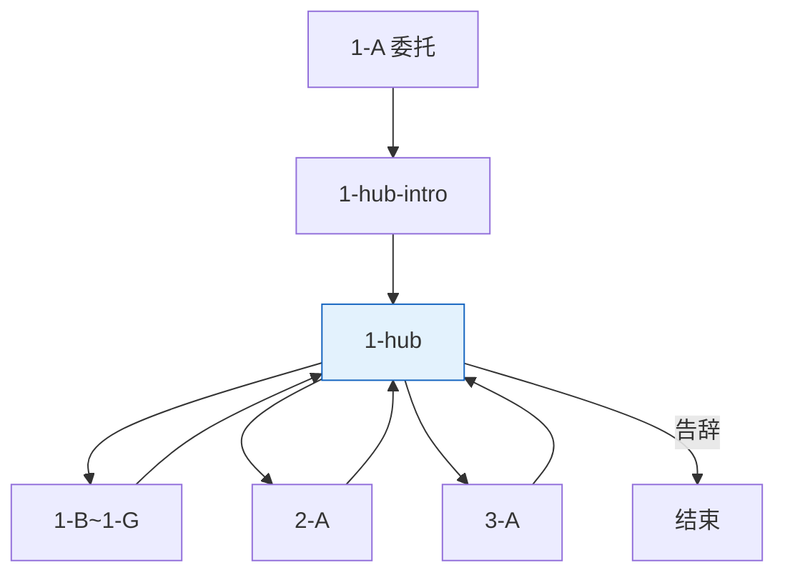

# 淑芬 · 对话脚本（树状）

> **状态**：淑芬对话**实施准稿**（以本树状脚本为准）。  
> **变量**：见 [17-全局游戏状态变量](../17-全局游戏状态变量.md)；本脚本只引用该表，不另造变量。跨 NPC 读写见 `17` §17.4 / §17.11。  
> **描述行**：text 树块内一律 `描述：（……）`，见 [18 §18.2](../18-树状对话脚本生成方法.md)。  
> **方法**：[18](../18-树状对话脚本生成方法.md) · [16](../16-NPC对话脚本书写守则.md)。

---

## 流程总览

**一、鸡舍**

1. **1-A** 强制委托 → **1-hub-intro【轮播】** → **1-hub【回访】+【菜单】**
2. **点淑芬** → **1-hub-intro** → **1-hub**
3. **1-B**～**1-G** / **2-A** / **3-A** 播完 → **1-hub**（直进真 hub，不重播 intro）

**二周目**：`NGPlus` → NGPlus【轮播】

变量写入见各节点【变量】；全局对照 [17 §17.11](../17-全局游戏状态变量.md#1711-淑芬树状脚本速查)。




**对话结束**：告辞、NGPlus【轮播】后结束；子项默认回 **1-hub**。

---

## 一、鸡舍

> 〔系统注〕点淑芬时，**按序匹配**：
>
> 1. `NGPlus` → NGPlus【轮播】
> 2. `!Shufen_CommissionDone` → **1-A** → **1-hub-intro** → **1-hub**
> 3. `Shufen_CommissionDone` → **1-hub-intro** → **1-hub**
>   （子项 **1-B**～**1-G** / **2-A** / **3-A** 出口**直进** **1-hub**，不经 intro）

---

### 1-A · 初次相遇与委托

> 〔系统注〕**首次点淑芬**播本段，只播一次。

```text
1-A
│
└─ 描述：（鸡舍门口，一只母鸡正站着，忽然抬起头来）
   淑芬：哎——你等一下！
   淑芬：帮个忙行不行？我找不到孩儿了——
   描述：（往鸡窝方向领了一步，又回头张望）
   淑芬：今早发现，我画了爱心标记的那最后一颗蛋，没了。
   淑芬：其他孩子出壳都好几天了，就这最小的——迟迟没动静，我一直守着它。
   淑芬：昨晚前还动过一下，那种感觉……我不可能认错的。
   描述：（停了停，看了看天）
   淑芬：最近天骤然凉了，我就担心——
   淑芬：主人也来看了好几回，就那样站着不说话。
   淑芬：你帮我找找吧，行吗？
   玩家：好，我来帮你找找。
   淑芬：谢谢你，真的。有什么要问的随时来找我——农场的事，我比谁都熟。

→ 1-hub-intro【轮播】 → 1-hub【回访】+【菜单】

【变量】
· Shufen_CommissionDone = true
```

---

### 1-hub-intro · 点淑芬回访轮播

> 〔系统注〕**点淑芬**按入口判定进入时必播（**1-A** 出口同理）；子项 **1-B**～**1-G** / **2-A** / **3-A** 返回**不经**本节点。等权重随机一条，不重复相邻两条；播毕 → **1-hub**。

```text
1-hub-intro
│
└─ 【轮播】
   ├─ 淑芬：你来了，快进来。
   │  淑芬：有发现吗？
   │  描述：（眼神里是止不住的期待，很快又压下去）
   ├─ 描述：（听见动静猛地抬起头）
   │  淑芬：哦，是你！
   │  淑芬：……怎么样了，有消息了吗？
   │  描述：（说完拢了拢翅膀，像是刚才那句话太着急了）
   └─ 淑芬：来了啊，进来坐。
      描述：（往窝边扫了一眼，目光停了停）

→ 1-hub【回访】+【菜单】
```

---

### 1-hub · 主菜单 hub（单句 + 菜单）

> 〔系统注〕**真 hub**：intro 播毕或子项返回时进入；**至少一句**【回访】后同屏【菜单】。同屏最多可见 **4** 项；程序取**已解锁**列表**前 3 项** +「我再去找找别的线索。」（固定末位）。下列顺序即优先级。

```text
1-hub
│
├─ 【回访】
│  淑芬：……还有什么我能做的吗？
│
└─ 【菜单】
   「发现和蛋有关的东西了，你看一下……」（E10_ViewWhiteStone && !Shufen_StoneRevealShown）→ 2-A
   「我觉得……主人把蛋带走了。」（DogStatus==4 && !Shufen_MasterTrustShown）→ 3-A
   「主人那边……你说他最近老在你窝边转悠？」→ 1-B
   「大黄好像喝多了，有什么办法叫醒他吗？」（DogStatus>=2 && !E05_GrainSoakGet）→ 1-G
   「那只乌鸦，你觉得它知道什么吗？」（DogStatus>=2）→ 1-C
   「池塘边那只青蛙，你了解它吗？」（Frog_FirstMeetShown）→ 1-D
   「红顶屋那俩老鼠，你知道它们的事吗？」（Mouse_FirstGreetShown）→ 1-E
   「谷仓那边有个午睡的草窝——那是你的吗？」（E07_ViewNapSpot && !Shufen_NapSpotAsked）→ 1-F
   「我再去找找别的线索。」→ 对话结束
```

---

### 1-B · 关于主人

```text
1-B
│
└─ 玩家：主人那边……你说他最近老在你窝边转悠？
   淑芬：就是老来窝边——有时候弯腰往里看，有时候只是站着。
   淑芬：我赶他，他就往后退半步，过一会儿又靠过来。
   描述：（停顿了一下）
   淑芬：他就是这样，担心的事放不下，但又不会说。
   淑芬：来了我就知道，他也在惦记着孩儿。

→ 1-hub【回访】+【菜单】
```

---

### 1-C · 关于乌鸦

```text
1-C
│
└─ 玩家：那只乌鸦，你觉得它知道什么吗？
   淑芬：那只乌鸦啊，什么东西都往顶上搬——亮的、白的、圆的，见了就叼。
   淑芬：谷仓顶堆了一堆，它自己稀罕得很，我们都懒得管它。
   淑芬：你要找什么丢了的东西，去它那翻翻也好。

→ 1-hub【回访】+【菜单】
```

---

### 1-D · 关于悲伤蛙

```text
1-D
│
└─ 玩家：池塘边那只青蛙，你了解它吗？
   淑芬：那只蛙啊……
   描述：（轻轻摇了摇头，是无奈不是嫌弃）
   淑芬：说的东西听不太懂，但它就在水边，什么路过的都看在眼里。
   淑芬：你去问问，就是耐心点——说话绕，多问几句。

→ 1-hub【回访】+【菜单】
```

---

### 1-E · 关于老鼠

```text
1-E
│
└─ 玩家：红顶屋那俩老鼠，你知道它们的事吗？
   淑芬：你跑去找那两个了？
   淑芬：那俩……消息是有的，就是爱掺水。
   描述：（翅膀拢了拢）
   淑芬：你要问，我不拦——自己分辨一下，哪句是真的，哪句是瞎掰的。

→ 1-hub【回访】+【菜单】
```

---

### 1-F · 可选闲聊 · 谷仓午睡点

```text
1-F
│
└─ 玩家：谷仓那边有个草窝——那是你的午睡点吗？
   淑芬：不是我，我不跑那么远。
   淑芬：鸡舍这边就挺好的...

→ 1-hub【回访】+【菜单】

【变量】
· Shufen_NapSpotAsked = true
```

---

### 1-G · 怎么叫醒大黄

```text
1-G
│
└─ 玩家：大黄好像喝多了，有什么办法把他叫醒吗？
   淑芬：那条蠢狗又喝多了？
   描述：（叹了口气）
   淑芬：狗窝都空着——准又醉在谷仓那边了。
   淑芬：你直接喊是喊不醒的，喝成那样。
   淑芬：鸡舍水槽边有桶老谷物泡水，他爱喝那个味儿，灌下去就醒了。
   描述：（停了一下）
   淑芬：……上次也是我给他端去的。

→ 1-hub【回访】+【菜单】
```

---

### 2-A · 认罪告知

> 〔系统注〕须持 E10；与 **3-A** **无先后**——`DogStatus==4` 可先走 **3-A** 再回访 **2-A**（仍须 `!Shufen_StoneRevealShown`）。播毕一次性，`Shufen_StoneRevealShown` 锁菜单。

```text
2-A
│
└─ 玩家：乌鸦屋顶有颗石头，上面画着爱心和鬼脸，你看长这样子。
   描述：（淑芬盯着笔记本，半天没动）
   淑芬：……这是石头？
   描述：（低头再看了一眼，抬起头）
   淑芬：石头。
   淑芬：大前天下午，我离窝去转了一圈，搞了搞沙浴，就那一小会儿。
   淑芬：回来一摸，蛋是冰冰凉的。
   描述：（停顿，声音低下去）
   淑芬：心一下子空了。我满院子跑，深蹲做到腿软，想要把孩儿焐回来。
   淑芬：跑累了回窝，蛋居然又热了。
   淑芬：我还以为是自己把孩儿焐热的。
   描述：（喙用力抿住）
   淑芬：那几个小崽子！阿满！你带他们干什么好事了！？
   淑芬：让我逮到，一个个都得打一顿！
   描述：（停了片刻，气势稍稍泄了一点）
   淑芬：……不过那是大前天下午的事。今早才发现蛋没了的。
   淑芬：谢谢你找到这个。

→ 1-hub【回访】+【菜单】

【变量】
· Shufen_StoneRevealShown = true
```

---

### 3-A · 主人方向确认

> 〔系统注〕须 `DogStatus==4`；与 **2-A** **无先后**。未持 E10 或未播 **2-A** 也可先走本段；**2-A** 仍须 `E10 && !Shufen_StoneRevealShown`，回访 hub 可补。

```text
3-A
│
└─ 玩家：我觉得……主人把蛋带走了。
   描述：（淑芬皱眉，想了想）
   淑芬：……主人？
   淑芬：主人绝对不是坏人。
   淑芬：大前天下午，我深蹲做到腿软那会儿——他就站在旁边看着，他也很担心的。
   描述：（停顿，羽毛微微绷了一下）
   淑芬：不会有事的。
   描述：（轻声，像是说给自己听）
   淑芬：……不会有事的。

→ 1-hub【回访】+【菜单】

【变量】
· Shufen_MasterTrustShown = true
```

---

## 二周目

```text
NGPlus 回访
│
└─ 【轮播】
   ├─ 淑芬：孩儿在身边了。谢谢你。
   │  玩家：淑芬，那只乌鸦叼的原来是石头。
   │  淑芬：……也挺搞的。
   │
   └─ 淑芬：主人那两脚兽……我以后也不赶他了。
      玩家：嗯。
      淑芬：……偶尔。

→ 对话结束
```

---

## 条件覆盖自检

### 入口判定

`NGPlus`→NGPlus【轮播】 · `!Shufen_CommissionDone`→**1-A**→**1-hub-intro**→**1-hub** · `Shufen_CommissionDone`→**1-hub-intro**→**1-hub** · 子项返 hub **直进** **1-hub**（不经 intro）

### 节点 / 菜单 / 返链


| 节点              | 进入（读取）                                                        | 菜单项 / 分支 | 下一跳（写入后）                                            |
| --------------- | ------------------------------------------------------------- | -------- | --------------------------------------------------- |
| **1-A**         | `!Shufen_CommissionDone`                                      | —        | **1-hub-intro**→**1-hub** · `Shufen_CommissionDone` |
| **1-hub-intro** | 点淑芬入口判定 / **1-A** 出口                                          | —（【轮播】）  | **1-hub**                                           |
| **1-hub**       | intro 播毕或子项返回                                                 | 话题 / 告辞  | 子项→**1-hub**；告辞→结束                                  |
| **1-B**         | **1-hub**                                                     | 主人       | **1-hub**                                           |
| **1-C**         | **1-hub** · `DogStatus>=2`                                    | 乌鸦       | **1-hub**                                           |
| **1-D**         | **1-hub** · `Frog_FirstMeetShown`                             | 青蛙       | **1-hub**                                           |
| **1-E**         | **1-hub** · `Mouse_FirstGreetShown`                           | 老鼠       | **1-hub**                                           |
| **1-F**         | **1-hub** · `E07_ViewNapSpot` · `!Shufen_NapSpotAsked`        | 午睡点      | **1-hub** · `Shufen_NapSpotAsked`                   |
| **1-G**         | **1-hub** · `DogStatus>=2` · `!E05_GrainSoakGet`              | 叫醒大黄     | **1-hub**                                           |
| **2-A**         | **1-hub** · `E10_ViewWhiteStone` · `!Shufen_StoneRevealShown` | 白石头 / E10 | **1-hub** · `Shufen_StoneRevealShown`               |
| **3-A**         | **1-hub** · `DogStatus==4` · `!Shufen_MasterTrustShown`       | 主人带走蛋    | **1-hub** · `Shufen_MasterTrustShown`               |
| **NGPlus**      | `NGPlus`                                                      | 【轮播】     | 对话结束                                                |


**本脚本【变量】块（4 处）**：`1-A` · `1-F` · `2-A` · `3-A`

---

*关联文档：[17](../17-全局游戏状态变量.md)、[13](../13-玩家线索与交互点总表.md)、[16](../16-NPC对话脚本书写守则.md)、[淑芬*](./淑芬.md)