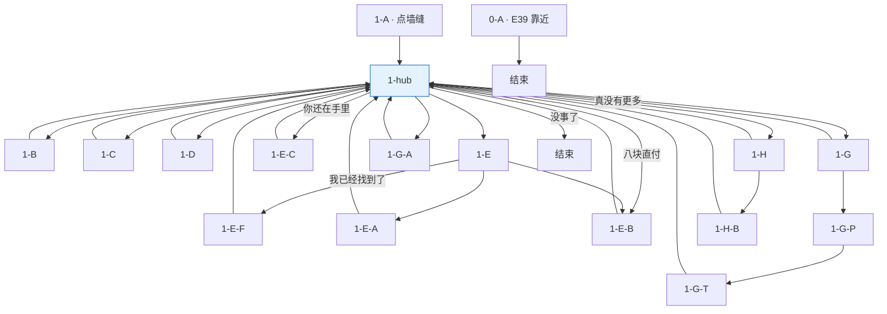

# 老鼠兄弟 · 对话脚本（树状）

> **状态**：老鼠兄弟对话**实施准稿**（以本树状脚本为准）。  
> **变量**：见 [17-全局游戏状态变量](../17-全局游戏状态变量.md)；本脚本只引用该表，不另造变量。  
> **描述行**：text 树块内一律 `描述：（……）`，见 [18 §18.2](../18-树状对话脚本生成方法.md)。  
> **方法**：[18](../18-树状对话脚本生成方法.md) · [16](../16-NPC对话脚本书写守则.md)。

---

## 流程总览

**一、墙缝黑市**

1. **0-A** 首次进入 **E39** 外围大范围 → **强制吆喝**（面向玩家 · 玩家搭两句）→ **对话结束**（不进入 hub；与点墙缝分流）
2. **1-A** 点击墙缝 · 首次问候 → **1-hub**
3. **1-hub**【回访】+【菜单】→ **1-B** / **1-C** / **1-D** / **1-E** / **1-E-B** / **1-G**·**1-G-A** / **1-E-C** / **1-H** / **1-H-B** → 默认回 **1-hub**

**薄荷鱼后组池**（`_03`～`_08`）：`Mouse_PremiumPoolUnlocked`。**付 8 块**（**1-E-B** 方向包 · **1-G-P** 蛙败打包 · **1-H-B** 未闻价补买）或**闻价后对峙开池**（**1-E-C** 免费）写入；与 `Mouse_MintFishPaid`（兜底资格）分离。

**hub 铁则**：子节点**仅**经【菜单】进入；禁止 hub **入口前置**强制跳播（**0-A** 靠近吆喝除外）。

**二周目**：`NGPlus` → NGPlus【轮播】

变量写入见各节点【变量】；全局对照 [17 §17.14](../17-全局游戏状态变量.md#1714-老鼠兄弟树状脚本速查)。

**预算保护**：`!MintFish_Obtained && !BlackCat_MintFishLineDone` 时，若 `CheeseCount-5<8` 则 **1-hub** 不显示贵情报项。




---

## 一、墙缝黑市

> 〔系统注〕**两类入口，勿混**：
>
> - **靠近喊话**：首次进入 **E39** 外围大范围 → **0-A** **强制播**（不需按交互键；面向玩家，玩家搭两句）→ 结束；只播一次（`Mouse_AreaCalloutShown`）。墙缝**点击交互点**仍较小，本段仅作导向。
> - **点墙缝**（NPC 交互键）→ 下列判定：

> 〔系统注〕点老鼠兄弟（墙缝）时，**按序匹配**：
>
> 1. `NGPlus` → NGPlus【轮播】
> 2. `!Mouse_FirstGreetShown` → **1-A** → **1-hub**
> 3. `Mouse_FirstGreetShown` → **1-hub**
>
> **1-hub** 仅【回访】+【菜单】；已取鱼未开池 → hub **1-E-C**（已闻价 · **无**情报门闩）或 **1-H**（未闻价 · 须 **开市前池售空**）。

---

### 0-A · 靠近喊话（强制播放）

> 〔系统注〕**E39** 外围 trigger：碰撞体覆盖红顶屋墙缝一侧及院中主路接近段（范围宜明显大于墙缝点击点）。首次进入范围**自动播**，只一次；不需按交互键。老鼠**面向玩家**吆喝；玩家搭两句捧哏（节奏参考大树 **1-A**），**无菜单**。播毕写 `Mouse_AreaCalloutShown`；**不**写 `Mouse_FirstGreetShown`，点墙缝仍走 **1-A**。

```text

0-A
│
└─ 描述：（墙缝方向，两双圆溜溜的眼睛先瞄向这边）
   鼠哥：喂——你！别走了——往红顶屋墙缝这边看！
   鼠弟：情报贩卖！
   鼠哥：童叟无欺——走过路过别错过——
   玩家：……谁在喊？
   鼠哥：做生意的。
   玩家：墙缝……里面？
   鼠弟：对！要聊就凑过来——
   描述：（裂口处昏黄灯光晃了一下）

→ 对话结束

【变量】
· Mouse_AreaCalloutShown = true
```

---

### 1-A · 首次问候

```text

1-A
│
└─ 描述：（墙缝里透出昏黄灯光，两双圆溜溜的眼睛盯过来）
   鼠弟：哟，来客人了。
   鼠哥：买情报的？
   玩家：……你们这里卖情报？
   鼠哥：这农场里发生的事，我们知道的比任何人都多。
   鼠弟：便宜的一块，贵一点的五块——
   鼠哥：货真价实。
   鼠弟：……偶尔掺一点点水。
   描述：（算盘轻敲了一下鼠弟的脑袋）
   鼠弟：……嗯。

→ 1-hub【回访】+【菜单】

【变量】
· Mouse_FirstGreetShown = true
```

---

### 1-hub · 主菜单 hub

> 〔系统注〕直出【回访】+【菜单】；**无入口前置**。
>
> **开市前池售空**（仅 **1-H** 门闩）：便宜池售空 **且** `Mouse_PremiumSold_01` **且** `Mouse_PremiumSold_02`。**1-E-C** **不**受此限（取鱼且闻价即可对峙开池）。
>
> 有可购情报项时鼠哥说「想买什么？」；便宜池与贵池均不可显示时说「没情报了，别的还有事吗？」。**薄荷鱼 hub 分项互斥**（见各菜单条件）。**蛙线已败**且**未付 8**：hub「那个青蛙…」→ **1-G**；**已付 8** →「青蛙那边…」→ **1-G-A**。蛙败后再走「黑猫叫我来……」仍进 **1-E**，正文播毕菜单选「我已经找到了。」→ **1-E-F**（**不**在 hub 拆项）。

```text

1-hub
│
├─ 【回访】
│  ├─ 【条件】（仍有便宜或贵情报可购）
│  │  鼠哥：想买什么？
│  └─ 【条件】（便宜池售空且贵池不可购）
│     鼠哥：没情报了，别的还有事吗？
│
└─ 【菜单】
   「便宜的，一块。」（便宜池未空 && CheeseCount>=1）→ 1-B
   「贵一点的，五块。」（贵池未空 && CheeseCount>=5 && 预算保护通过）→ 1-C
   「那只黑猫好像一直盯着你们……」（Dog_BlackCatSummoned && !Mouse_BlackCatStareShown）→ 1-D
   「黑猫叫我来找你……」（BlackCat_MintFishPending && !Mouse_MintFishPaid && !MintFish_Obtained && !Mouse_MintFishPitchShown）→ 1-E
   「八块奶酪碎，给你。」（BlackCat_MintFishPending && !Mouse_MintFishPaid && !MintFish_Obtained && Mouse_MintFishPitchShown && !Frog_PadRefused && CheeseCount>=8）→ 1-E-B
   「那个青蛙，有没有什么办法搞定？」（Frog_PadRefused && !Mouse_FrogFallbackGiven && !MintFish_Obtained && !Mouse_MintFishPaid）→ 1-G
   「青蛙那边有点麻烦。」（Frog_PadRefused && !Mouse_FrogFallbackGiven && !MintFish_Obtained && Mouse_MintFishPaid）→ 1-G-A
   「你不是说东西还在你手里吗？」（MintFish_Obtained && Mouse_MintFishPitchShown && !Mouse_MintFishPaid && !Mouse_PremiumPoolUnlocked）→ 1-E-C
   「真没有更多情报了吗？」（MintFish_Obtained && !Mouse_MintFishPitchShown && !Mouse_PremiumPoolUnlocked && 开市前池售空）→ 1-H
   「没事了。」→ 对话结束
```

> 〔系统注〕**贵池未空**：`Mouse_PremiumSold_01`～`08` 中仍有未售；**后 6 条**（`_03`～`_08`）须 `**Mouse_PremiumPoolUnlocked`** 后入池（**1-E-B** / **1-H-B** 付 8 块 **或** **1-E-C** 对峙开池）。**预算保护通过**：`MintFish_Obtained || BlackCat_MintFishLineDone || CheeseCount>=13`。

---

### 1-B · 便宜情报（1 块）

> 〔系统注〕从未售池**随机**抽一条，不重复。售空后 **1-hub** 不显示便宜项。扣 1 `CheeseCount`；播毕写对应 `Mouse_CheapSold_##` → **1-hub**。

```text

1-B · #01 大黄项圈
│
└─ 描述：（鼠哥收下奶酪，算盘拨一下）
   鼠哥：农场那条狗，大黄，见过吗？
   鼠弟：它的项圈是镀银的！
   鼠哥：主人省钱买甜玉米糖，狗戴镀银项圈。
   描述：（鼠弟憋笑，没憋住）
   鼠弟：这个农场的钱花得太奇妙了……

【变量】· Mouse_CheapSold_01 = true

1-B · #02 悲伤蛙前世
│
└─ 描述：（鼠哥收下奶酪）
   鼠哥：池塘那只蛙，见过没？
   鼠弟：就是整天盯着水面叹气的那只——
   鼠哥：它年轻时是整片水域公认的第一情圣。
   玩家：……什么？
   鼠弟：排队的！
   鼠哥：就是它。
   描述：（两只老鼠同时沉默了一下）

【变量】· Mouse_CheapSold_02 = true

1-B · #03 淑芬过去
│
└─ 描述：（鼠哥收下奶酪）
   鼠哥：鸡舍那只最大的母鸡，淑芬，认识吗？
   鼠弟：十年前是隔壁村的斗鸡冠军！主人花了大价钱把她买回来。
   鼠哥：现在不打了，安心下蛋。
   鼠弟：据说。
   鼠哥：据说。
   描述：（两只老鼠对视了一眼，一起不说话了）

【变量】· Mouse_CheapSold_03 = true

1-B · #04 Flash
│
└─ 描述：（鼠哥收下奶酪）
   鼠哥：鸡舍外宽叶上的蜗牛，注意到没？
   鼠弟：商业间谍！隔壁农场派来的！
   鼠哥：在偷绘这个农场的地图，已经三年了。
   玩家：……蜗牛？
   鼠弟：三年！一点一点地爬！
   描述：（鼠哥神情肃然，像在汇报军机大事）

【变量】· Mouse_CheapSold_04 = true

1-B · #05 主人床底书
│
└─ 描述：（鼠哥收下奶酪）
   鼠哥：主人床底有本书。
   鼠弟：《母鸡的产后护理》！！
   鼠哥：鸡科圣手，尤其精通这一本。
   鼠弟：他每次进鸡舍对淑芬说'好孩子'——那是产后护理第三招！！
   描述：（鼠哥没有补充，表情有点微妙）

【变量】· Mouse_CheapSold_05 = true

1-B · #06 大橡树
│
└─ 描述：（鼠哥收下奶酪）
   鼠哥：那棵大橡树，仔细看了没？
   鼠弟：它会走路的！
   玩家：……
   鼠哥：一年挪一厘米。根系把这片地底下的水分全部吸走了。
   鼠弟：整个农场地底都是它的领地——
   鼠哥：表面上看，只是一棵树。
   描述：（二人一本正经）

【变量】· Mouse_CheapSold_06 = true

1-B · #07 大黄喝醉（叫醒三源之一）
│
└─ 描述：（鼠哥收下奶酪，算盘拨了两下）
   鼠哥：那条狗大黄，偶尔偷喝主人的发酵苹果渣。
   鼠弟：有次喝大了，整晚趴在谷仓墙根出不来！大半个身子压着一架木梯！
   鼠哥：最后淑芬端了鸡舍水槽边那桶泡软的谷物过去，把他叫醒了。
   鼠弟：大黄平时特别馋那个——
   鼠哥：我们亲眼看见的。

【变量】· Mouse_CheapSold_07 = true

1-B · #08 主人盯鸡舍
│
└─ 描述：（鼠哥收下奶酪，算盘拨慢了）
   鼠哥：主人这几天，常趴窗往鸡舍方向看。
   鼠弟：看完又不进去！就在屋里翻箱倒柜！
   鼠哥：很忙，不知道忙什么。
   鼠弟：我们猜可能是——
   鼠哥：没有结论的不卖。

【变量】· Mouse_CheapSold_08 = true

1-B · #09 小鸡昨晚
│
└─ 描述：（鼠哥收下奶酪）
   鼠哥：那群戴假墨镜的小鬼，注意过没？
   鼠弟：昨晚集体缩在鸡舍里，一步都不出来！
   鼠哥：抱成一团，像在等什么。
   鼠弟：从来没见过它们那么安静——
   鼠哥：等的是什么，不知道。

【变量】· Mouse_CheapSold_09 = true

1-B · #10 黑猫爬谷仓顶
│
└─ 描述：（鼠哥收下奶酪，算盘重重拨了一下）
   鼠哥：这条值价。
   鼠哥：前天下午，黑猫自己爬上了谷仓屋顶。
   鼠弟：没多大会儿，又下来了，爪子上什么都没带！！
   鼠哥：三年宿仇，竟然没打起来。
   玩家：……上去干什么？
   鼠哥：不知道。没有情报的地方，就是没有。

【变量】· Mouse_CheapSold_10 = true

→ 1-hub【回访】+【菜单】
```

---

### 1-C · 贵情报（5 块）

> 〔系统注〕从未售池随机一条。`_01`/`_02` 随时可抽；`_03`～`_08` 须 `**Mouse_PremiumPoolUnlocked**` 后入池。扣 5 `CheeseCount`。

```text

1-C · #01 水怪编造
│
└─ 描述：（鼠哥收下奶酪，算盘拨得很慢）
   鼠哥：你知道那群小鸡为什么怕水怪吗？
   鼠弟：因为我们跟它们说池塘那边有沼泽水怪——哈哈——
   描述：（鼠弟捂住嘴，停下来）
   鼠弟：……那天看见它们推了个泥糊糊的圆东西路过谷仓，太好玩了，随口编的。
   鼠哥：小鸡胆子小，听半句能补十句。

【变量】· Mouse_PremiumSold_01 = true

1-C · #02 乌鸦捡白亮之物
│
└─ 描述：（鼠哥收下奶酪，算盘响了两声）
   鼠哥：谷仓顶的乌鸦，前天早上从鸡舍门口草丛边捡了个东西。
   鼠弟：白白的！亮亮的！大大的！
   鼠哥：飞回谷仓顶的时候，兴奋得像捡到王冠。
   玩家：捡的是什么？
   鼠哥：不知道。白白亮亮，这就是我们能卖的全部了。

【变量】· Mouse_PremiumSold_02 = true

1-C · #03 昨晚黄灯
│
└─ 描述：（鼠哥收下奶酪，算盘拨慢了）
   鼠哥：昨晚深夜，红顶屋里亮起一个黄灯。
   鼠弟：刺眼！穿墙缝的那种！
   鼠哥：墙里同时传来细细的嗡声，一直嗡着不停歇。
   鼠弟：就像屋里突然多了一个不会落山的小太阳——
   鼠哥：有光有热，里面是什么，不知道。

【变量】· Mouse_PremiumSold_03 = true

1-C · #04 主人两趟雨靴
│
└─ 描述：（鼠哥收下奶酪）
   鼠哥：昨晚深夜，主人的雨靴来回走了两趟。
   鼠弟：一趟回来，带着湿泥水气！
   鼠哥：另一趟，脚步朝鸡舍方向走远，又回来。
   玩家：……手里拿什么了？
   鼠哥：看不见，只有声音和气味。
   鼠弟：一趟湿泥、一趟朝鸡舍——挺奇怪的，对不对。

【变量】· Mouse_PremiumSold_04 = true

1-C · #05 水怪声=醉狗鼾
│
└─ 描述：（鼠哥收下奶酪）
   鼠弟：你知道水怪声是怎么来的吗——
   鼠哥：昨晚深夜，鸡舍方向传来一阵低闷带哨音的声音。
   鼠弟：'呼噜噜——咕呱——'
   描述：（鼠弟绘声绘色演示）
   鼠哥：味道是发酵苹果渣和醉狗口气。
   玩家：……醉狗？
   鼠弟：那不是水怪，是大黄打的呼噜！！
   鼠哥：小鸡说的水怪低吼……
   鼠弟：醉狗的鼾声而已！

【变量】· Mouse_PremiumSold_05 = true

1-C · #06 黑猫篱笆（bullshit）
│
└─ 描述：（鼠哥收下奶酪，压低了声音）
   鼠哥：这条，自信度较高。
   鼠弟：昨晚深夜，从墙缝亲眼看见——
   鼠哥：黑猫在篱笆边，和它自己的影子，咬耳朵。
   玩家：……咬什么？
   鼠弟：闷声不吭、鬼鬼祟祟、对着影子嘀嘀咕咕——
   鼠哥：农场黑市猫帮，有大动作。
   描述：（鼠弟重重点头，神情严峻）

【变量】· Mouse_PremiumSold_06 = true

1-C · #07 南墙缝旧事（bullshit）
│
└─ 描述：（鼠哥收下奶酪，算盘搭在爪子上）
   鼠哥：这面墙南段，以前住着另一家卖情报的，跟我们一个行当。
   鼠弟：被我们搞垮了！
   鼠哥：他们卖的全是假货，我们举报了，后来墙被修缮，把那边堵死了。
   鼠弟：现在这个农场只有我们一家——
   鼠哥：垄断。
   描述：（鼠哥扬了扬算盘，表情颇为满足）

【变量】· Mouse_PremiumSold_07 = true

1-C · #08 Flash飞（bullshit）
│
└─ 描述：（鼠哥收下奶酪）
   鼠哥：昨晚深夜，亲眼目睹。
   鼠弟：Flash——飞起来了！！！
   玩家：……
   鼠哥：从宽叶上飞起，盘旋了一圈，落回去。
   鼠弟：我们当时都看傻了——
   鼠哥：商业间谍的实力，超出我们的想象。

【变量】· Mouse_PremiumSold_08 = true

→ 1-hub【回访】+【菜单】
```

---

### 1-D · 黑猫盯视闲聊

> 〔系统注〕免费、一次性。`Mouse_BlackCatStareShown` 后 **1-hub** 不再显示该项。

```text

1-D
│
└─ 玩家：那只黑猫好像一直盯着你们这边看……
   描述：（两只老鼠同时往墙缝里缩了半个身子，鼠哥先探出头来）
   鼠哥：……猫天生不对付老鼠，正常。
   鼠弟：哥，它今天盯得特别久——
   鼠哥：你别说话。
   鼠弟：好。
   描述：（鼠哥往大橡树方向扫了一眼，没有进一步解释，缩回墙缝）

→ 1-hub【回访】+【菜单】

【变量】
· Mouse_BlackCatStareShown = true
```

---

### 1-E · 薄荷鱼报价（未取鱼 · 付 8 块）

> 〔系统注〕`BlackCat_MintFishPending && !Mouse_MintFishPaid && !MintFish_Obtained && !Mouse_MintFishPitchShown`（**1-hub** 菜单 · **首访**；蛙败亦同入口）。播毕写 `Mouse_MintFishPitchShown`。`!Frog_PadRefused` → 菜单「给你。」/「先不给。」；`Frog_PadRefused` → 菜单「我已经找到了。」→ **1-E-F**（拒收方向费，**不**经 **1-E-B**）。再访 hub 直付 **1-E-B** 须 `!Frog_PadRefused && CheeseCount>=8`。

```text

1-E
│
└─ 玩家：黑猫叫我来找你……说你手里有她的东西。
   描述：（鼠哥停了一拍，算盘没动。鼠弟刚想开口）
   鼠哥：我来说。
   描述：（鼠哥清了清嗓子，像在思考措辞）
   鼠哥：哦，那件东西啊……
   鼠哥：还在。
   鼠弟：哥——
   鼠哥：……
   鼠哥：东西还在我这，你要取回去？
   玩家：……对。
   鼠哥：那当然可以。
   鼠哥：只不过，东西放我们这里——保管费、搬运费、折旧费……综合算下来，八块奶酪碎，公道价。
└─ 【菜单】
   「给你。」（!Frog_PadRefused && CheeseCount>=8）→ 1-E-B
   「先不给。」（!Frog_PadRefused）→ 1-E-A
   「我已经找到了。」（Frog_PadRefused）→ 1-E-F

【变量】
· Mouse_MintFishPitchShown = true
```

---

### 1-E-F · 拒付 · 方向费豁免（**1-E** 内出口 · 路径 **G0-E**）

> 〔系统注〕**1-E** 菜单「我已经找到了。」· `Frog_PadRefused`（**非** hub 项）。玩家听完 **1-E** 报价后拒付方向费；**不**写 `Mouse_MintFishPaid`。**不谈**蛙线（蛙兜底回 hub「那个青蛙…」→ **1-G**）。

```text

1-E-F
│
└─ 玩家：我已经找到了。
   鼠哥：找到了？
   玩家：你还说在你这儿，纯骗啊哥们儿。
   鼠哥：……
   鼠弟：那你还——
   描述：（鼠哥把账本合上，算盘没响）
   描述：（鼠弟还想说什么，生生咽了回去）

→ 1-hub【回访】+【菜单】
```

---

### 1-E-A · 拒绝支付

```text

1-E-A
│
└─ 玩家：先不给。
   鼠哥：没有钱，什么都没有。
   鼠弟：随时回来——

→ 1-hub【回访】+【菜单】
```

---

### 1-E-B · 支付成功

> 〔系统注〕进入：**1-E** 菜单「给你。」**或** **1-hub**「八块奶酪碎，给你。」（`Mouse_MintFishPitchShown && !Frog_PadRefused && CheeseCount>=8`）。扣 8 `CheeseCount`；写 `Mouse_MintFishPaid` + `Mouse_PremiumPoolUnlocked`（后组池入池 + **1-G-A** 兜底资格）。

```text

1-E-B
│
└─ 描述：（鼠哥接过奶酪，算盘响了三声）
   鼠哥：好，我去拿——
   描述：（鼠哥往墙缝深处探了一下，回来时神情如常）
   鼠哥：……稍微有个情况。
   鼠弟：从这里往池塘方向跑的时候——
   鼠哥：手滑了。掉在池塘边一带了。
   玩家：掉了？！你刚说还在你这里？
   鼠哥：在我辖区范围内，广义上来说，还是在的。
   鼠弟：方向给你了！这叫知情告知！
   描述：（鼠哥把账本翻了一页，表情笃定）
   鼠哥：往池塘那边找，就是了。
   描述：（鼠弟探出头来，压低声音）
   鼠弟：哥，这单大，要不要……
   鼠哥：……看在大单份上，这里又多了一批情报，你随时来抽。

→ 1-hub【回访】+【菜单】

【变量】
· Mouse_MintFishPaid = true
· Mouse_PremiumPoolUnlocked = true
```

---

### 1-E-C · 对峙开池（已取鱼 · 已闻价 · 免费开后组）

> 〔系统注〕**1-hub** 菜单「你不是说东西还在你手里吗？」→ `MintFish_Obtained` · `Mouse_MintFishPitchShown` · `!Mouse_MintFishPaid` · `!Mouse_PremiumPoolUnlocked`（**无**开市前池门闩）。玩家持「还在手里」谎言与已取鱼事实**对峙**；鼠兄弟认怂，**免费**开后组池。**不扣费**；写 `Mouse_PremiumPoolUnlocked`，**不写** `Mouse_MintFishPaid`（**无**蛙兜底资格）。

```text

1-E-C
│
└─ 玩家：你不是说东西还在你手里吗？
   描述：（鼠弟往鼠哥身后一缩，半张脸都不露了）
   鼠哥：……
   玩家：鱼我已经从池塘拿回来了。
   描述：（鼠哥算盘从爪上滑下去，没接稳）
   鼠弟：（压声）哥——
   鼠哥：小点声。
   玩家：黑猫那边要是问起来，我怎么说，你们掂量。
   描述：（沉默。鼠哥把账本按在墙缝里，很久没动）
   鼠哥：……行。这笔算我们办砸了。
   鼠哥：柜里还有一批贵情报，本来要配货才能给的。给你随便买吧。
   鼠弟：那批不得再等等——
   鼠哥：开。
   描述：（鼠弟把嘴闭紧；墙缝里再没有算盘声）

→ 1-hub【回访】+【菜单】

【变量】
· Mouse_PremiumPoolUnlocked = true
```

---

### 1-G · 青蛙兜底 · 未付入口（蛙线已败）

> 〔系统注〕**1-hub**「那个青蛙，有没有什么办法搞定？」→ `Frog_PadRefused && !Mouse_FrogFallbackGiven && !MintFish_Obtained && !Mouse_MintFishPaid`。玩家因蛙 **3-B** 回来求助；**不**走 hub「八块奶酪碎，给你。」（与蛙败态互斥）。**1-G-P** 付 8 写 `Mouse_MintFishPaid` + `Mouse_PremiumPoolUnlocked` → **1-G-T**（排第七口诀，同 **1-G-A** 尾段）。

```text

1-G
│
└─ 玩家：那个青蛙，有没有什么办法搞定？
   描述：（鼠弟探出头来）
   鼠弟：就那个整天坐池塘边叹气的？
   鼠哥：有。
   鼠哥：八块奶酪碎。教你一句糊弄它的。
   鼠哥：一口价。
└─ 【菜单】
   「给你。」（CheeseCount>=8）→ 1-G-P
   「算了。」→ 1-hub【回访】+【菜单】
```

---

### 1-G-P · 蛙兜底 · 付 8 块

> 〔系统注〕**1-G** 菜单「给你。」&& `CheeseCount>=8`。扣 8 `CheeseCount`；写 `Mouse_MintFishPaid` + `Mouse_PremiumPoolUnlocked` → **1-G-T**。

```text

1-G-P
│
└─ 玩家：给你。
   描述：（鼠哥接过奶酪，算盘响了三声）
   鼠哥：好。
   描述：（鼠哥把账本翻了一页，表情笃定）
   鼠哥：付清这八块，后面还有一批贵情报——现在也一起给您开放购买了。
   鼠弟：口诀呢——
   鼠哥：听好——

→ 1-G-T

【变量】
· Mouse_MintFishPaid = true
· Mouse_PremiumPoolUnlocked = true
```

---

### 1-G-A · 青蛙兜底 · 已付入口（含在 8 块包内）

> 〔系统注〕**1-hub**「青蛙那边有点麻烦。」→ `Mouse_MintFishPaid && Frog_PadRefused && !Mouse_FrogFallbackGiven && !MintFish_Obtained`（路径 **B**；老鼠已知付过 8 块与蛙线前情，兜底**不**再扣费）。汇入 **1-G-T**；蛙 **3-hub**→**3-D** 可读。

```text

1-G-A
│
└─ 玩家：青蛙那边有点麻烦。
   描述：（鼠弟探出头来，没忍住）
   鼠弟：就那个整天坐池塘边叹气的？我知道它！
   鼠哥：我来说。
   描述：（鼠哥把账本翻到某一页，停了一下）
   鼠哥：这本来是要收你钱的。
   鼠弟：对，这是额外服务——
   鼠哥：但看在你那单大……
   描述：（鼠哥把账本合上，算盘在指尖转了一圈）

→ 1-G-T
```

---

### 1-G-T · 排第七口诀（兜底正文）

> 〔系统注〕**1-G-A**（已付）或 **1-G-P**（未付付清）汇入。播毕写 `Mouse_FrogFallbackGiven`。

```text

1-G-T
│
└─ 鼠哥：那只蛙嘛，你别跟它讲道理，也别安慰它。
   玩家：那怎么办？
   鼠哥：你就告诉它——
   鼠哥：我走南闯北，见过很多只跟它一模一样的蛙，说的话我都能背出来了。它在这一带顶多排第七。
   描述：（鼠弟压低声音）
   鼠弟：哥……你真的去排过名？
   鼠哥：够了。
   描述：（鼠哥递出一个眼神，意思是：去吧）

→ 1-hub【回访】+【菜单】

【变量】
· Mouse_FrogFallbackGiven = true
```

> 〔系统注〕已给后 **1-hub** 不再显示蛙兜底项（「那个青蛙……」/「青蛙那边有点麻烦。」）。

---

### 1-H · 补买后组（已取鱼 · 未闻报价）

> 〔系统注〕**1-hub** 菜单「真没有更多情报了吗？」→ `MintFish_Obtained` · `!Mouse_MintFishPitchShown` · `!Mouse_PremiumPoolUnlocked` · **开市前池售空**（路径 **D** / **J** 等：**未**进过 **1-E** 已自主取鱼）。**1-H-B** 付 8 开池，**不写** `Mouse_MintFishPaid`。听过报价且已取鱼者 hub **1-E-C** 免费开池，**不**进本节点。

```text

1-H
│
└─ 玩家：真没有更多情报了吗？
   描述：（鼠哥算盘停了一拍）
   鼠哥：有。
   鼠弟：柜里还有一批——
   鼠哥：五块那档，你买到头也摸不全。
   玩家：那怎么开？
   鼠哥：八块奶酪碎。不开价，不给看货。
   鼠弟：……这是规矩。
   鼠哥：规矩。
└─ 【菜单】
   「给你。」（CheeseCount>=8）→ 1-H-B
   「算了。」→ 1-hub【回访】+【菜单】
```

---

### 1-H-B · 补买成功

> 〔系统注〕**1-H** 菜单「给你。」&& `CheeseCount>=8`。扣 8 `CheeseCount`；写 `Mouse_PremiumPoolUnlocked`（后组池入池）。**不写** `Mouse_MintFishPaid`。

```text

1-H-B
│
└─ 玩家：给你。
   描述：（鼠哥接过奶酪，算盘响了三声）
   鼠哥：开柜。
   鼠弟：后面那批——现在就能抽喽！
   鼠哥：去挑。挑完别赖账。
   描述：（账本后几页被翻出来，比前面厚一截）

→ 1-hub【回访】+【菜单】

【变量】
· Mouse_PremiumPoolUnlocked = true
```

---

## 二周目

```text

NGPlus 回访
│
└─ 【轮播】
   ├─ 鼠哥：还有没买的，自己来挑。
   │  鼠弟：奶酪够的话——
   │  鼠哥：够不够是他们的事。
   │
   ├─ 鼠弟：蜗牛 Flash 今天又去绕了新一圈。
   │  鼠哥：地图更新了。
   │  玩家：……你们是认真的？
   │  鼠哥：一块钱的情报，今日免费。
   │
   └─ 鼠哥：事都查清楚了吧。
      玩家：差不多了。
      鼠哥：那就好。
      描述：（算盘在爪子上轻弹了一下，没有进一步的话）
   
 

→ 对话结束
```

---

## 条件覆盖自检

### 入口判定

**E39 靠近**：`!Mouse_AreaCalloutShown` → **0-A** → 结束

**点墙缝**：`NGPlus`→NGPlus【轮播】 · `!Mouse_FirstGreetShown`→**1-A**→**1-hub** · `Mouse_FirstGreetShown`→**1-hub**

### 节点 / 菜单 / 返链


| 节点         | 进入（读取）                                                                                                                                                         | 【变量】写入                                                                | 出口                                |
| ---------- | -------------------------------------------------------------------------------------------------------------------------------------------------------------- | --------------------------------------------------------------------- | --------------------------------- |
| **0-A**    | **E39** 首次进入 · `!Mouse_AreaCalloutShown`                                                                                                                       | `Mouse_AreaCalloutShown`                                              | 对话结束                              |
| **1-A**    | 点墙缝 · `!Mouse_FirstGreetShown`                                                                                                                                 | `Mouse_FirstGreetShown`                                               | **1-hub**                         |
| **1-hub**  | `Mouse_FirstGreetShown`                                                                                                                                        | —                                                                     | 子项 / 告辞                           |
| **1-B**    | 便宜池未空 · `CheeseCount>=1`                                                                                                                                       | `Mouse_CheapSold_##`（扣 1 `CheeseCount`）                               | **1-hub**                         |
| **1-C**    | 贵池未空 · `CheeseCount>=5` · 预算保护                                                                                                                                 | `Mouse_PremiumSold_##`（扣 5 `CheeseCount`）                             | **1-hub**                         |
| **1-D**    | `Dog_BlackCatSummoned` · `!Mouse_BlackCatStareShown`                                                                                                           | `Mouse_BlackCatStareShown`                                            | **1-hub**                         |
| **1-E**    | `BlackCat_MintFishPending` · `!Mouse_MintFishPaid` · `!MintFish_Obtained` · `!Mouse_MintFishPitchShown`                                                        | `Mouse_MintFishPitchShown`                                            | **1-E-A** / **1-E-B** / **1-E-F** |
| **1-E-F**  | **1-E** 菜单「我已经找到了。」· `Frog_PadRefused`                                                                                                                         | —                                                                     | **1-hub**                         |
| **1-E-A**  | **1-E** 菜单「先不给。」                                                                                                                                               | —                                                                     | **1-hub**                         |
| **1-E-B**  | **1-E**「给你。」**或** **1-hub**「八块奶酪碎，给你。」· `BlackCat_MintFishPending` · `!MintFish_Obtained` · `Mouse_MintFishPitchShown` · `!Frog_PadRefused` · `CheeseCount>=8` | `Mouse_MintFishPaid` · `Mouse_PremiumPoolUnlocked`（扣 8 `CheeseCount`） | **1-hub**                         |
| **1-E-C**  | **1-hub**「你不是说东西还在你手里吗？」· `MintFish_Obtained` · `Mouse_MintFishPitchShown` · `!Mouse_MintFishPaid` · `!Mouse_PremiumPoolUnlocked`                              | `Mouse_PremiumPoolUnlocked`                                           | **1-hub**                         |
| **1-G**    | **1-hub**「那个青蛙，有没有什么办法搞定？」· `Frog_PadRefused` · `!Mouse_FrogFallbackGiven` · `!MintFish_Obtained` · `!Mouse_MintFishPaid`                                      | —                                                                     | **1-G-P** / **1-hub**             |
| **1-G-P**  | **1-G** 菜单「给你。」· `CheeseCount>=8`                                                                                                                              | `Mouse_MintFishPaid` · `Mouse_PremiumPoolUnlocked`（扣 8 `CheeseCount`） | **1-G-T**                         |
| **1-G-A**  | **1-hub**「青蛙那边有点麻烦。」· `Frog_PadRefused` · `!Mouse_FrogFallbackGiven` · `!MintFish_Obtained` · `Mouse_MintFishPaid`                                             | —                                                                     | **1-G-T**                         |
| **1-G-T**  | **1-G-A** 或 **1-G-P** 汇入                                                                                                                                       | `Mouse_FrogFallbackGiven`                                             | **1-hub**                         |
| **1-H**    | **1-hub**「真没有更多情报了吗？」· `MintFish_Obtained` · `!Mouse_MintFishPitchShown` · `!Mouse_PremiumPoolUnlocked` · **开市前池售空**                                           | —                                                                     | **1-H-B** / **1-hub**             |
| **1-H-B**  | **1-H** 菜单「给你。」· `CheeseCount>=8`                                                                                                                              | `Mouse_PremiumPoolUnlocked`（扣 8 `CheeseCount`）                        | **1-hub**                         |
| **NGPlus** | `NGPlus`                                                                                                                                                       | —                                                                     | 对话结束                              |


**本脚本【变量】块**：`0-A` · `1-A` · `1-B`/`1-C` 各情报条 · `1-D` · `1-E` · `1-E-B` · **1-E-C** · **1-G-P** · **1-G-T** · **1-H-B**

---

*关联文档：[17](../17-全局游戏状态变量.md)、[13](../13-玩家线索与交互点总表.md)、[16](../16-NPC对话脚本书写守则.md)、[老鼠兄弟*](./老鼠兄弟.md)