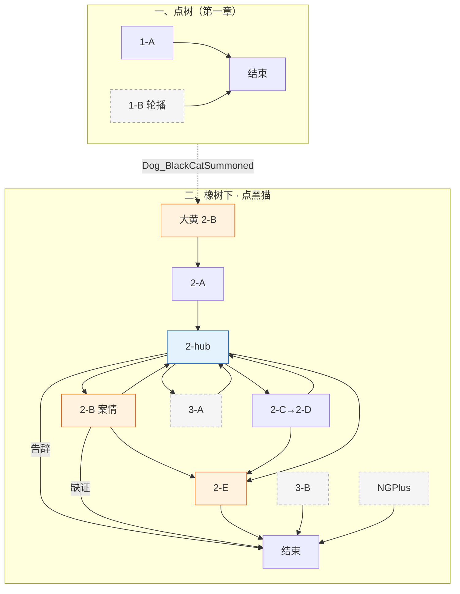

# 黑猫 · 对话脚本（树状）

> **状态**：黑猫对话**实施准稿**（以本树状脚本为准）。  
> **变量**：见 [17-全局游戏状态变量](../17-全局游戏状态变量.md)；本脚本只引用该表，不另造变量。  
> **方法**：[18](../18-树状对话脚本生成方法.md) · [16](../16-NPC对话脚本书写守则.md)；text 树块内描述行 `**描述：（……）`**（`18` §18.2 步骤 6）。

---

## 流程总览

**一、大橡树（第一章 · 树上独白）**

> **地点**为大橡树；**交互对象**分两种：**点树**（第一章隐藏独白，说话方「大树」）与 **点树下黑猫 NPC**（第二章起，见下节）。二者勿混。

1. **1-A** 首次点树硬触发 → `BlackCat_TreeHardShown=true` → **对话结束**
2. **1-B** 再点树【轮播】；`Dog_BlackCatSummoned` 后**不可再点树**（改点黑猫）

**二、大橡树下（第二章 · 点黑猫 NPC）**

> 场景仍在橡树下，**交互对象是黑猫**（`Dog_BlackCatSummoned` 后）；**2-A** 接大黄 **2-B** 后播。

1. **2-A** 被晃下树（大黄 **2-B** 出口）→ **2-hub【回访】+【菜单】**
2. **2-hub** 谈判 hub：案情 **2-B** / 薄荷鱼 **2-C**→**2-D** / 揭穿 **3-A**（菜单）· 告辞结束；**3-B** 漫画收束后走路由直进
3. **2-B** 案情开场必播（只一次）→ **2-B-hub** 物证菜单 → **2-B-A** / **2-B-B** → **2-B-C** 顿悟 → **2-hub** 或 **2-E**
4. **2-C** 薄荷鱼线 → `BlackCat_MintFishPending` →（老鼠 / 蛙线）→ **2-D** 交还 → **2-hub** 或 **2-E**
5. **2-E** 双路汇合起身开窗（`BlackCat_CaseLineDone && BlackCat_MintFishLineDone`）→ `BlackCat_Entered=true` → **对话结束**
6. **2-F** 攻顶途中屋内放话（E37 / E38【氛围】，非点击黑猫）

**三、揭穿黑幕（可选）**

- **3-A** 早触发（hub 菜单 · 推理路径）
- **3-B** 晚触发（黑猫路由 · `Comic_Revealed` 兜底）

**二周目**：`NGPlus` → 点**树下黑猫** → **NGPlus 回访**【轮播】

变量写入见各节点【变量】；全局对照 [17 §17.9](../17-全局游戏状态变量.md#179-黑猫树状脚本速查与样章对齐)。

### 分章流程图




**图例**：橙色 = 关键质询 / 切场；蓝色 = hub（**【回访】+【菜单】**）。**3-B** / **NGPlus** 见 §二「点黑猫时进哪段对话」；**2-C** 取物经老鼠 / 蛙线（图外）；**2-F** 为 E37 / E38 氛围，非点击黑猫。

**对话结束**：大树 **1-A** / **1-B** · **2-B** 无物证卡点 / **2-B-D** · **2-hub** 告辞 · **2-E** · **NGPlus** 写「→ 对话结束」；**2-A**→**2-hub**、子项回 hub、**2-B-C**/**2-D**→**2-E** 等不写。

---

## 一、大橡树

> 〔系统注〕第一章黑猫躲树冠，**不可见、不可交互**。玩家**点大橡树**时，说话方显示 **「大树」**（不是黑猫）。按下面情况进对话：
>
> - **大黄已经摇过树、黑猫落地了**（`Dog_BlackCatSummoned`）：大树不再回应——请去点**树下蹲着的黑猫**。
> - **你还没听过树上那句伏笔**（`!BlackCat_TreeHardShown`）：进 **1-A**，必播「傻子在炫耀，瞎子在到处问。」
> - **其余时候**：进 **1-B**【轮播】闲聊。

---

### 1-A · 首次靠近（硬触发）

> 〔系统注〕第一次靠近大橡树必播，只一次。伏笔句全玩家必听过。

```text
1-A
│
└─ 大树：傻子在炫耀，瞎子在到处问。
   玩家：谁？大树？大树说话了？
   大树：咳咳，嗯……是本树在说话。
   玩家：哦！那大树你说的傻子和瞎子是谁？
   大树：……走吧，凡人。别踩我的根。

→ 对话结束

【变量】
· BlackCat_TreeHardShown = true
```

---

### 1-B · 再次靠近

> 〔系统注〕`BlackCat_TreeHardShown`。等权重【轮播】；`DogStatus>=2` 时「屋顶蠢东西」「凌晨四点」两条入池。

```text
1-B
│
└─ 【轮播】
   ├─ 玩家：大树？
   │  大树：你踩到我的根了。
   │  玩家：哦，对不起。
   │  大树：……
   │  大树：无趣。
   │
   ├─ 玩家：大树，农场里出大事了，你知道吗？
   │  大树：吵。
   │  玩家：什么吵？
   │  大树：你说话，吵。
   │
   ├─ 玩家：大树你每天在这里，能看到什么？
   │  大树：凡人……看见的永远是自己想看见的。
   │  玩家：……大树，这话有点深。
   │  大树：走吧。
   │
   ├─ 【条件】（DogStatus>=2）
   │  玩家：大树，谷仓屋顶上是不是有什么东西？
   │  大树：屋顶那只蠢东西……
   │  大树：还守着他的宝贝呢。
   │  玩家：什么宝贝？
   │  大树：有什么好守的。
   │  玩家：你是说乌鸦吗？
   │  大树：本树不指名道姓。
   │
   └─ 【条件】（DogStatus>=2）
      玩家：大树，你有没有听到什么奇怪的声音？
      大树：谷仓顶上那个，今天又叫……
      玩家：谁在叫？
      大树：你说他叫什么叫。每天凌晨四点，已经三年了。
      大树：……走吧。

→ 对话结束
```

---

## 二、大橡树下

> 〔系统注〕**地点**是大橡树下，**点的是黑猫 NPC**（`Dog_BlackCatSummoned` 之后才有）。玩家点黑猫时，**从上到下看哪条符合，就进哪段对话**（不是菜单里排第几条）：
>
> - **二周目**（`NGPlus`）：进 **NGPlus 回访**，播释怀盘，对话结束。（只点黑猫，不点树。）
> - **漫画演完、还没揭穿「早知石头」**（`Comic_Revealed && !BlackCat_StoneRevealShown`）：进 **3-B**，补问揭穿，对话结束。（黑猫可能已进屋，仍可点。）
> - **案情线和薄荷鱼线都谈完了、黑猫还没进屋**（`BlackCat_CaseLineDone && BlackCat_MintFishLineDone && !BlackCat_Entered`）：进 **2-E** 汇合开窗，对话结束。
> - **大黄摇过树、黑猫还在树下**（`Dog_BlackCatSummoned && !BlackCat_Entered`）：进 **2-hub** 谈判菜单。
> - **黑猫已经钻进屋里了**（`BlackCat_Entered`）：树下黑猫不可再点；攻顶途中放话见 **2-F**（E37 / E38），不经过点击。
>
> **2-A** 只在大黄 **2-B** 摇树演出里播，玩家不能单独点进。

---

### 2-A · 现身：被晃下树

> 〔系统注〕衔接大黄 **2-B** → **2-hub【回访】+【菜单】**。

```text
2-A
│
└─ 描述：（树冠剧烈颤动，一只黑猫从树上落地，毛发炸乱，白眼一翻）
   黑猫：滚——开！
   黑猫：没看到本喵正因感情欺骗疗伤吗？！
   玩家：等等……这声音……
   玩家：你就是那棵大树！！
   黑猫：……是猫。
   描述：（大黄压低声音）
   大黄：你跟大树说话了？
   玩家：我以为……
   描述：（黑猫深吸一口气，抬爪梳了两下乱毛，没梳平，更烦）
   黑猫：那个该死的两脚兽！
   黑猫：昨晚用温柔手法骗本喵——
   黑猫：他把本喵捧起来，本喵以为是要按摩——
   黑猫：结果把本喵放在冰冷地板上！
   黑猫：抢走本喵的御用软垫！
   玩家：啊……那挺过分的。
   黑猫：还有你！
   描述：（黑猫视线漫不经心扫过大黄）
   黑猫：……地毯。
   大黄：什么？！
   黑猫：那只鸟叫你的。
   描述：（停顿一秒）
   黑猫：把树晃成那样？！这是什么不文明的手段？！
   大黄：不摇你不下来嘛。
   描述：（黑猫将视线缓缓滑向玩家，停住）
   黑猫：……你又是谁？
   玩家：我是侦探，在调查淑芬的蛋失踪案。
   黑猫：鸡的事，和本喵有什么关系。
   描述：（黑猫在大橡树根旁坐下，尾巴慢速扫地，一副不想理人的架子，但没有离开）

→ 2-hub【回访】+【菜单】
```

---

### 2-hub · 树下谈判

> 〔系统注〕`Dog_BlackCatSummoned && !BlackCat_Entered`。先播【回访】，同屏【菜单】。  
> 若案情、薄荷鱼两路都已齐且 `!BlackCat_Entered`，再点黑猫时**不进 hub**，直接进 **2-E**（见章首说明）。  
> **案情项分流**：`!BlackCat_CaseLineStarted` → **2-B**（「蛋的线索……」，只一次）；`BlackCat_CaseLineStarted && !BlackCat_CaseLineDone` → **2-B-hub**（「还有新线索……」，补证 / 续选物证）。

```text
2-hub
│
├─ 【回访】
│  黑猫：……
│
└─ 【菜单】
   「蛋的线索指向红顶屋里面。」（!BlackCat_CaseLineDone && !BlackCat_CaseLineStarted）→ 2-B
   「我还有新的线索要汇报。」（!BlackCat_CaseLineDone && BlackCat_CaseLineStarted）→ 2-B-hub
   「谷仓角落那里……那个草窝，是你的吧。」（!BlackCat_MintFishLineDone && E07_ViewNapSpot && E08_ViewBurnMark && !BlackCat_MintFishPending）→ 2-C
   「找回来了。」（BlackCat_MintFishPending && MintFish_Obtained && !BlackCat_MintFishLineDone）→ 2-D
   「你上谷仓屋顶那次——」（!BlackCat_StoneRevealShown && E10_ViewWhiteStone && BlackCat_MintFishLineDone && !BlackCat_Entered）→ 3-A
   「先不打扰你了。」→ 对话结束
```

> 〔系统注〕**3-A** 仅 **2-hub**【菜单】、起身前（`!BlackCat_Entered`）；需 `E10_ViewWhiteStone`。**3-B** 不进 hub——漫画后点黑猫走路由直进（见章首说明）；与 **3-A** 共用 `BlackCat_StoneRevealShown`。

---

### 2-B · 案情汇报线 · 开场必播

> 〔系统注〕`!BlackCat_CaseLineStarted`。从 **2-hub** 选「蛋的线索……」**只进入一次**。  
> **三条必经事实**（玩家走到这里时**主线已经给齐**，不必拆菜单，合并成一段说完；见 `16`「硬必证据」）：
> 空窝无闯入 · 大黄嗅觉确认蛋味仍在红顶屋内 · 悲伤蛙「冰冷容器 / 生命之源」。  
> 播毕写 `BlackCat_CaseLineStarted=true`。玩家只列事实、不下结论（禁保温箱 / 孵化等揭晓词）。  
> 三条播完后：`!E17 && !E18` → **对话结束**；`E17 || E18` → **2-B-hub**。

```text
2-B
│
└─ 玩家：蛋的线索指向红顶屋里面。
   黑猫：……说来听听。
   黑猫：本喵不承诺有反应。
   玩家：淑芬今天早上醒来，蛋不见了。
   黑猫：……然后呢。
   玩家：但窝里没有打斗迹象，没有外来气味，也没有拖拽痕迹。
   黑猫：没有闯入迹象。
   黑猫：自己跑走的？
   玩家：大黄的鼻子刚恢复，他说蛋的气味现在还从红顶屋里飘出来。
   黑猫：那只蠢狗的鼻子，在这件事上倒是有用。
   玩家：还有昨晚悲伤蛙看见了什么——
   玩家：高大的两脚兽，带着冰冷的容器，把什么「生命之源」从池塘抽走了。
   黑猫：……那只蛤蟆的措辞一向如诗如画。
   描述：（黑猫停顿，眼神开始算什么）
   黑猫：但「冰冷的容器」和「生命之源」……
   黑猫：继续。
   │
   ├─ 【条件】（!E17_ViewEmptyBucket && !E18_ViewBootprints）
   │  黑猫：你说主人昨晚出去过——有什么能证明？
   │  玩家：……我再去看看。
   │  黑猫：去吧。
   │  → 对话结束
   │
   └─ 【条件】（E17_ViewEmptyBucket || E18_ViewBootprints）
      → 2-B-hub【回访】+【菜单】

【变量】
· BlackCat_CaseLineStarted = true
```

---

### 2-B-hub · 物证菜单

> 〔系统注〕`BlackCat_CaseLineStarted && !BlackCat_CaseLineDone`。  
> **入口**：**2-B** 播毕 · **2-hub** 补证（`Started && !Done`）· **2-B-A** / **2-B-B** 播毕回 hub。  
> 水桶 / 雨靴并列菜单，已播项隐藏；两项都播过 → **2-B-C**，不再回 hub。  
> `E17` / `E18` 为红顶屋外勘察写入（见 `13`），不在本节点写入。

```text
2-B-hub
│
├─ 【回访】
│  黑猫：……
│
└─ 【菜单】
   「门旁有个空水桶，桶底是池塘泥沙。」（E17_ViewEmptyBucket && !BlackCat_CaseLineBucketSaid）→ 2-B-A
   「门前的雨靴脚印，夜里朝鸡窝方向。」（E18_ViewBootprints && !BlackCat_CaseLineBootSaid）→ 2-B-B
   「先说到这儿。」（!BlackCat_CaseLineBucketSaid || !BlackCat_CaseLineBootSaid）→ 2-B-D
```

---

### 2-B-A · 水桶

> 〔系统注〕`E17_ViewEmptyBucket && !BlackCat_CaseLineBucketSaid`（**2-B-hub**【菜单】）。

```text
2-B-A
│
└─ 玩家：门旁有个空水桶，桶底是池塘泥沙。
   描述：（黑猫的视线落在玩家身上，停了一秒）
   黑猫：冰冷的容器。就是这个。
   玩家：那悲伤蛙昨晚看见的人——就在这栋屋子里。
   描述：（黑猫尾巴慢了下来，不再扫地，只是压着）

→ 2-B-hub【回访】+【菜单】（!BlackCat_CaseLineBootSaid）
→ 2-B-C（BlackCat_CaseLineBootSaid）

【变量】
· BlackCat_CaseLineBucketSaid = true
```

---

### 2-B-B · 雨靴印

> 〔系统注〕`E18_ViewBootprints && !BlackCat_CaseLineBootSaid`（**2-B-hub**【菜单】）。

```text
2-B-B
│
└─ 玩家：门前的雨靴脚印，夜里朝鸡窝方向。
   描述：（黑猫停住）
   黑猫：鸡窝。夜里。

→ 2-B-hub【回访】+【菜单】（!BlackCat_CaseLineBucketSaid）
→ 2-B-C（BlackCat_CaseLineBucketSaid）

【变量】
· BlackCat_CaseLineBootSaid = true
```

---

### 2-B-D · 卡点（先说到这儿）

> 〔系统注〕**2-B-hub**【菜单】「先说到这儿。」；`!BlackCat_CaseLineBucketSaid || !BlackCat_CaseLineBootSaid` 时可点（还有物证未在菜单里播完）。

```text
2-B-D
│
└─ 黑猫：还不够。
   玩家：……我再去看看。
   黑猫：去吧。

→ 对话结束
```

---

### 2-B-C · 顿悟

> 〔系统注〕`BlackCat_CaseLineBucketSaid && BlackCat_CaseLineBootSaid`。由 **2-B-A** / **2-B-B** 第二项进入；无菜单入口。

```text
2-B-C
│
└─ 黑猫：昨晚，有人去池塘取了水。
   黑猫：然后，夜里去了鸡窝。
   黑猫：现在，蛋的气味从红顶屋里飘出来。
   描述：（沉默）
   黑猫：那家伙昨晚进鸡窝拿走了蛋。
   黑猫：带进了红顶屋。
   玩家：但为什么？
   黑猫：……
   黑猫：本喵也想知道。
   描述：（站起来了一点，又坐回去）
   黑猫：他在用那颗蛋做什么。

→ 2-hub【回访】+【菜单】（!BlackCat_MintFishLineDone && !BlackCat_Entered）
→ 2-E（BlackCat_MintFishLineDone && !BlackCat_Entered）

【变量】
· BlackCat_CaseLineDone = true
```

---

### 2-C · 薄荷鱼线 · 打开

> 〔系统注〕`!BlackCat_MintFishLineDone && E07_ViewNapSpot && E08_ViewBurnMark`（**2-hub**【菜单】）。玩家此时**还不知道**丢的是薄荷鱼，只察觉草窝、焦痕与老鼠有关。

```text
2-C
│
└─ 玩家：谷仓角落那里——有个被压扁的草窝。
   玩家：旁边还有烧焦的稻草和皮毛。是你的吧？
   描述：（黑猫骤然抬眼，定住）
   黑猫：……你怎么知道那个。
   玩家：那个焦痕是怎么回事？
   黑猫：还不是那只死鸟——
   描述：（立刻收住）
   黑猫：……但那件事跟你无关。
   描述：（黑猫停顿，视线短暂飘向红顶屋墙缝方向，很快收回；尾巴尖弹动了一下）
   玩家：跟老鼠有关系吗？
   黑猫：……你在乱猜什么。
   玩家：我帮你把这事办妥——你帮我开屋子。
   描述：（黑猫沉默，眯起眼睛，打量玩家，停了很久）
   黑猫：……
   黑猫：去找老鼠。
   黑猫：找回来再说。

→ 2-hub【回访】+【菜单】

【变量】
· BlackCat_MintFishPending = true
```

> 〔系统注〕取回路径见 [老鼠兄弟-对话脚本](./老鼠兄弟-对话脚本.md) 薄荷鱼专线、[悲伤蛙-对话脚本](./悲伤蛙-对话脚本.md)；取得后写 `MintFish_Obtained`（蛙线 / 老鼠线，见 `17`）。黑猫派活时**不说物件名称**，玩家从老鼠 / 蛙处才知道是薄荷鱼。

---

### 2-D · 交还薄荷鱼

> 〔系统注〕`BlackCat_MintFishPending && MintFish_Obtained && !BlackCat_MintFishLineDone`（**2-hub**【菜单】「找回来了。」，或持鱼自动高亮同项）。

```text
2-D
│
└─ 玩家：找回来了。
   描述：（薄荷鱼递出）
   描述：（黑猫耳朵竖起来，尾巴拍了两下——立刻压住）
   黑猫：……哼。
   描述：（慢慢走近，低头闻了一下，忍了一秒，吸了一大口——喉咙里半秒呼噜，骤然停住）
   黑猫：喵……就是这个——不对！
   描述：（往后退半步，爪子压住鱼）
   黑猫：一条臭鱼，买不走本喵！
   大黄：（小声）你刚才呼噜了……
   黑猫：你耳朵出问题了。

→ 2-hub【回访】+【菜单】（!BlackCat_CaseLineDone）
→ 2-E（BlackCat_CaseLineDone && !BlackCat_Entered）

【变量】
· BlackCat_MintFishLineDone = true
```

---

### 2-E · 汇合：起身去开窗

> 〔系统注〕`BlackCat_CaseLineDone && BlackCat_MintFishLineDone && !BlackCat_Entered`。黑猫路由或 **2-B-C** / **2-D** 出口 → **2-E**。大黄激将正文见下（原大黄样章 **2-D** 迁此）。

```text
2-E
│
└─ 大黄：猫大爷，昨晚的事你清楚吗？
   玩家：大黄……
   大黄：你可是被那个两脚兽当面骗了一手啊！
   大黄：整个农场都看着你睡得呼呼的、还以为是要给你按摩——
   黑猫：……
   大黄：——结果一觉醒来，软垫没了，自尊扫地！
   大黄：这要是传出去，今年冬天你睡稻草堆里，我可不让你蹭我狗窝。
   描述：（黑猫的尾巴猛地弹了一下，然后静止）
   描述：（非常缓慢地，从蹲位站起来；用眼神冻住大黄——大黄讪讪地把头转开）
   黑猫：本喵不是因为那只发疯母鸡。
   黑猫：也不是因为这条蠢狗指使。
   描述：（低头，用嘴叼起薄荷鱼）
   黑猫：就要亲眼进屋看清楚。
   黑猫：那家伙昨晚到底拿本喵的软垫做了什么。
   黑猫：垫子去了哪里。
   黑猫：至于你说的那颗破蛋——既然它现在多半就在屋里，顺便看一眼也不亏。
   黑猫：本喵有专属钥匙。你要进去——爬二层窗。本喵从里面推开。你不许走本喵的猫门。
   描述：（黑猫利落地钻进猫门）
   描述：（片刻后，红屋顶二层的窗子被从内推开，传来一声清脆的啪嗒）

→ 对话结束

【变量】
· BlackCat_Entered = true
```

> 〔系统注〕二层窗攻顶解锁；再点大黄走 **2-E**（见 [大黄-对话脚本-树状样章](./大黄-对话脚本-树状样章.md)）。攻顶途中 E37 / E38 播 **2-F**，不点黑猫。

---

### 2-F · 攻顶途中屋内放话（氛围）

> 〔系统注〕**E37** / **E38**【氛围】远程触发；玩家跳跃中无台词、无菜单。逐句见下；不承担新线索。

**F-1**（E37 · 起跳后第一段）

```text
黑猫：别刮花屋檐。
黑猫：那是本喵晒太阳的位置。
描述：（屋里传来一声很轻的尾巴拍地声）
黑猫：你摔下去，本喵不会下去捡。
```

**F-2**（E38 · 接近二层窗之前）

```text
黑猫：二层窗开着。
黑猫：侦探还在屋檐上犹豫。
黑猫：本喵开始怀疑你和那只狗是同一种跳跃水平。
```

---

## 三、揭穿黑幕（可选）

### 3-A · 早触发

> 〔系统注〕**2-hub**【菜单】；`E10_ViewWhiteStone && BlackCat_MintFishLineDone && !BlackCat_Entered && !BlackCat_StoneRevealShown`。

```text
3-A
│
└─ 玩家：你上谷仓屋顶那次——是不是已经知道那是块石头？
   描述：（黑猫停顿，舔了一下爪子）
   黑猫：嗯。早上窗台就看见了——乌鸦俯冲，白石头在晨光里闪着。
   描述：（黑猫瞥了大黄一眼）
   黑猫：任何不瞎的都看得出来不是蛋。
   玩家：你为什么不说！！
   黑猫：那只乌鸦，每天早上四点开始嘎嘎嘎。
   黑猫：已经三年了。
   黑猫：让侦探多转几圈……本喵觉得相当公平。
   描述：（黑猫偏头，眼神有一丝难以察觉的满意）
   黑猫：本喵在树上不是说过吗？
   黑猫：「傻子在炫耀，瞎子在到处问。」
   玩家：……等等。
   玩家：那句话是在说乌鸦和我？！
   黑猫：你以为本喵是在骂大树吗。

→ 2-hub【回访】+【菜单】

【变量】
· BlackCat_StoneRevealShown = true
```

---

### 3-B · 晚触发（兜底）

> 〔系统注〕`Comic_Revealed && !BlackCat_StoneRevealShown`。漫画收束后点黑猫走路由直进（见章首说明；**不要求** `!BlackCat_Entered`）。播毕**对话结束**，不再进 **2-hub**。

```text
3-B
│
└─ 玩家：你之前上谷仓屋顶——那时候就知道是块石头，对不对？
   描述：（黑猫睨过来一眼）
   黑猫：……这才反应过来？
   黑猫：早上窗台就看见了。白石头，晨光一照，闪得很——任何不瞎的都看得出来不是蛋。
   玩家：你为什么不说？！
   黑猫：那只乌鸦，每天早上四点开始嘎嘎嘎。
   黑猫：已经三年了。
   黑猫：让侦探多转几圈……本喵觉得相当公平。
   黑猫：你们最后找到了，不是吗。

→ 对话结束

【变量】
· BlackCat_StoneRevealShown = true
```

---

## 二周目

> 〔系统注〕`NGPlus`。漫画合本后，玩家**点树下黑猫 NPC**（非常驻「点树」交互）触发 **NGPlus 回访**【轮播】，无推进。

```text
NGPlus 回访
│
└─ 【轮播】
   ├─ 黑猫：软垫回来了。
   │  黑猫：本喵勉强同意把那间屋子继续租给那家伙住。
   │  玩家：那颗蛋呢？
   │  黑猫：那颗破蛋……
   │  黑猫：本喵暂时替它看着。
   │  黑猫：就这样。
   │
   └─ 玩家：你下次还会上那棵树吗？
      黑猫：本喵在树上休息，不是在说话。
      黑猫：下次别跟大树搭腔了。
      描述：（叼着薄荷鱼，尾巴高高翘起）

→ 对话结束
```

---

## 条件覆盖自检

### 入口路由

**点树（第一章）**：`Dog_BlackCatSummoned`→大树不回应 · `!BlackCat_TreeHardShown`→**1-A** · 否则→**1-B**

**点黑猫**：`NGPlus`→**NGPlus** · `Comic_Revealed&&!StoneRevealShown`→**3-B** · 双路齐且`!BlackCat_Entered`→**2-E** · `Dog_BlackCatSummoned&&!BlackCat_Entered`→**2-hub** · `BlackCat_Entered`→不可点

### 节点 / 菜单 / 返链


| 节点          | 进入（读取）                                        | 出口                             | 写入                            |
| ----------- | --------------------------------------------- | ------------------------------ | ----------------------------- |
| **1-A**     | 树路由                                           | 结束                             | `BlackCat_TreeHardShown`      |
| **1-B**     | 树路由                                           | 结束                             | —                             |
| **2-A**     | 大黄 **2-B**                                    | **2-hub**                      | —                             |
| **2-hub**   | `Dog_BlackCatSummoned&&!BlackCat_Entered`     | 子项 / 告辞→结束；路由双路齐→**2-E**       | —                             |
| **2-B**     | `!BlackCat_CaseLineStarted`（**2-hub** 菜单）     | 无物证→结束；有物证→**2-B-hub**         | `BlackCat_CaseLineStarted`    |
| **2-B-hub** | `Started && !Done`（**2-B** / **2-hub**）       | 子项 / **2-B-D**→结束；齐项→**2-B-C** | —                             |
| **2-B-A**   | **2-B-hub** 菜单                                | **2-B-hub** 或 **2-B-C**          | `BlackCat_CaseLineBucketSaid` |
| **2-B-B**   | **2-B-hub** 菜单                                | **2-B-hub** 或 **2-B-C**          | `BlackCat_CaseLineBootSaid`   |
| **2-B-D**   | **2-B-hub** 菜单                                | 结束                             | —                             |
| **2-B-C**   | **2-B-A**/**2-B-B**                             | **2-hub** 或 **2-E**            | `BlackCat_CaseLineDone`       |
| **2-C**     | hub 菜单                                        | **2-hub**                      | `BlackCat_MintFishPending`    |
| **2-D**     | hub 菜单                                        | **2-hub**或**2-E**              | `BlackCat_MintFishLineDone`   |
| **2-E**     | 黑猫路由 / **2-B-C** / **2-D**                    | 结束                             | `BlackCat_Entered`            |
| **2-F**     | E37/E38                                       | —（氛围，无对话结束）                    | —                             |
| **3-A**     | hub 菜单                                        | **2-hub**                      | `BlackCat_StoneRevealShown`   |
| **3-B**     | 黑猫路由（漫画后）                                     | 结束                             | `BlackCat_StoneRevealShown`   |
| **NGPlus**  | `NGPlus`                                      | 结束                             | —                             |


### 变量必要性（本脚本写入 9 处）


| 变量                            | 必要性                                         |
| ----------------------------- | ------------------------------------------- |
| `BlackCat_TreeHardShown`      | 树 ch1：`1-A` 与 `1-B` 分流                      |
| `BlackCat_CaseLineStarted`    | **2-B** 开场必播一次性；**2-hub** 补证改直进 **2-B-hub** |
| `BlackCat_CaseLineBucketSaid` | **2-B-hub** 水桶项隐藏；齐项进 **2-B-C**             |
| `BlackCat_CaseLineBootSaid`   | **2-B-hub** 雨靴项隐藏；齐项进 **2-B-C**             |
| `BlackCat_CaseLineDone`       | 解锁 **2-E**（与薄荷鱼线 AND）                       |
| `BlackCat_MintFishPending`    | hub「找回来了」与「草窝」菜单互斥                          |
| `BlackCat_MintFishLineDone`   | 解锁 **2-E**；**3-A** 窗口                       |
| `BlackCat_Entered`            | 大黄 **2-E**；黑猫不可再点                           |
| `BlackCat_StoneRevealShown`   | 揭穿一次性；**3-A**/**3-B** 互斥                    |


**只读（他线写入）**：`Dog_BlackCatSummoned` · `DogStatus` · `E07`/`E08`/`E10`/`E17`/`E18` · `MintFish_Obtained` · `Comic_Revealed` · `NGPlus`

### 对话结束一览（仅必要处）


| 结束  | 节点                                  | 原因                |
| --- | ----------------------------------- | ----------------- |
| ✓   | **1-A** / **1-B**                   | 大树 ambient        |
| ✓   | **2-B** 无物证卡点 / **2-B-D**           | 须离场补线索或补选物证项      |
| ✓   | **2-hub** 告辞                        | 主动退出谈判            |
| ✓   | **2-E**                             | 黑猫进屋切场            |
| ✓   | **3-B** / **NGPlus**                | 一次性收束             |
| ✗   | **2-A**→**2-hub**                   | —                   |
| ✗   | **2-B-C**/**2-C**/**2-D**/**3-A** 后 | **2-hub** 或 **2-E** |


**本脚本【变量】块**：`1-A` · `2-B` · `2-B-A` · `2-B-B` · `2-B-C` · `2-C` · `2-D` · `2-E` · `3-A`/`3-B`（**2-B-hub** / **2-B-D** 无写入）

---

*关联文档：[17-全局游戏状态变量](../17-全局游戏状态变量.md)、[13-玩家线索与交互点总表](../13-玩家线索与交互点总表.md)、[黑猫角色设计](./黑猫.md)、[大黄-对话脚本-树状样章*](./大黄-对话脚本-树状样章.md)